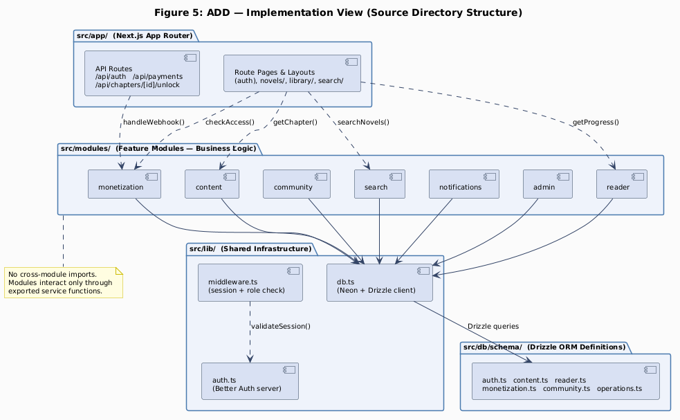
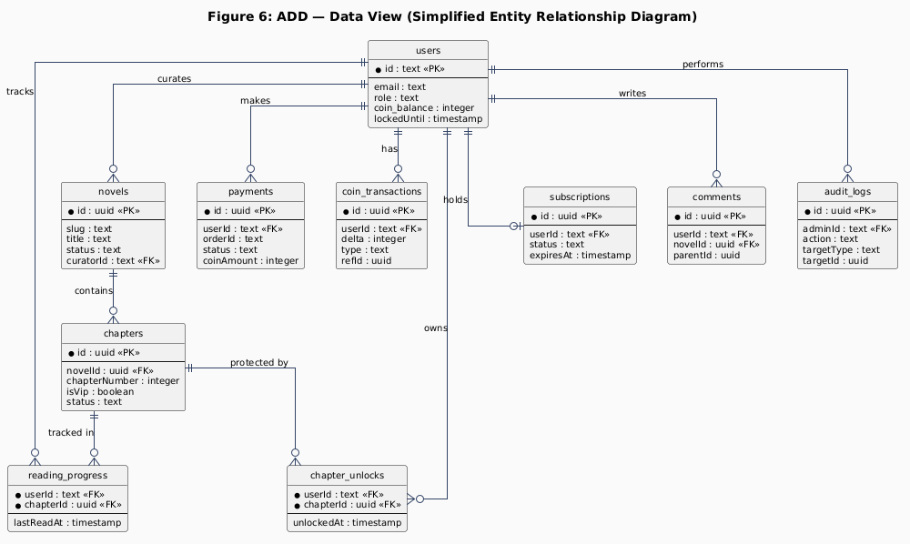

# Revision History

| Version | Date       | Author            | Changes                          |
|---------|------------|-------------------|----------------------------------|
| 1.0     | 17/05/2026 | Architecture Team | Initial release                  |

\pagebreak

# 1. Design Constraints

Design constraints are system-level properties that bound the architecture regardless of quality attribute priorities. They reflect business, technical, and operational realities that the architecture must accommodate.

**DC-01 Scalability.** The platform targets 500 DAU at launch, with growth potential to 5,000+ DAU as the subscriber base expands. Chapter reads (free and VIP) are the dominant traffic pattern and must be handled without increasing infrastructure cost linearly.

**DC-02 Availability.** Free chapter reading must remain accessible to guests and readers at all times, including during origin server degradation. CDN-cached pages provide a read-availability layer independent of the application server. Payment and coin operations may be temporarily unavailable during outages but must never result in partial data.

**DC-03 Reliability.** Coin balance changes, VIP chapter unlocks, and payment processing must be fully transactional. Any partial write must roll back completely. The coin ledger (`coin_transactions`) must always reflect the exact state of `users.coin_balance`.

**DC-04 Security.** VIP chapter content is gated by active subscription or coin balance verification. Admin and Curator routes require role enforcement on every request. Payment webhooks from MoMo must be HMAC-SHA256 verified before any database mutation. User sessions use httpOnly cookies to prevent JavaScript-based session theft.

**DC-05 Modifiability.** Content publishing, payment processing, and search are implemented as isolated feature modules (`src/modules/`). Each module can be modified or replaced without importing from or breaking other modules. Auth, DB client, and utilities are shared infrastructure in `src/lib/` and must contain no business logic.

**DC-06 Deployment.** The application runs on Vercel serverless (zero server management). External managed services: Neon PostgreSQL (database), Upstash Redis (sessions), Meilisearch Cloud (search), Cloudinary (image CDN), MoMo / VNPay (payment gateways). All configuration is via environment variables. No Docker or reverse proxy required on Vercel.

\pagebreak

# 2. Quality Attribute Requirements

Each quality attribute requirement is expressed as a scenario following the IEEE QA scenario structure: **Stimulus → Stimulus Source → Environment → Artifact → Response → Response Measure**.

## 2.1 Security

### 2.1.1 Authentication and Authorization

Only authenticated users with valid sessions may access protected routes. Curator role is required for chapter publishing. Admin role is required for moderation actions. Any request to a protected route without a valid session or with an incorrect role must be rejected before reaching business logic.

| Element          | Statement |
|------------------|-----------|
| Stimulus         | HTTP request to a protected route: GET `/library`, POST `/api/chapters/{id}/unlock`, POST `/api/admin/chapters`, POST `/api/admin/reports/{id}/resolve` |
| Stimulus source  | Authenticated user, unauthenticated visitor, or attacker probing API routes directly |
| Environment      | Normal operating conditions (development and production) |
| Artifact         | `src/middleware.ts` (edge middleware), Better Auth session handler, Upstash Redis (session store) |
| Response         | Middleware reads session cookie; validates token against Upstash Redis; checks role from session payload; forwards request if valid, redirects to sign-in page if no session, returns HTTP 403 if role is insufficient |
| Response measure | 100% of requests to protected routes rejected without a valid session; role mismatch returns HTTP 403 in < 5 ms; zero business logic executed before auth check completes |

### 2.1.2 VIP Content Protection

VIP chapter content (body text and structured data) must not be rendered or returned in any HTTP response to a client that does not have an active coin unlock or Premium subscription for that chapter. Content must be absent from the server-rendered HTML — not merely hidden by CSS or JavaScript.

| Element          | Statement |
|------------------|-----------|
| Stimulus         | GET request to a VIP chapter page by a Reader without an existing unlock, or a direct API call to the chapter content endpoint |
| Stimulus source  | Reader without unlock or subscription; attacker bypassing the frontend UI |
| Environment      | Normal load; user has a valid session but no coin unlock and no active subscription for the requested chapter |
| Artifact         | Chapter RSC page (`app/novels/[slug]/chapters/[n]/page`), monetization module `checkAccess()` |
| Response         | RSC calls `monetization.checkAccess(userId, chapterId)`; if `access = false`, RSC renders the VIP lock overlay without fetching or including chapter body text in HTML; chapter content is not queried from DB when access is denied |
| Response measure | Chapter body text is absent from HTML source for unauthorized users; VIP content leakage = 0 bytes in server-rendered output; access check completes in < 15 ms |

### 2.1.3 Payment Webhook Integrity

MoMo payment webhook payloads must be cryptographically verified using HMAC-SHA256 before any coin credit, payment status update, or database mutation is performed. Unverified or tampered webhooks must be rejected without revealing error details.

| Element          | Statement |
|------------------|-----------|
| Stimulus         | HTTP POST to `/api/payments/momo/webhook` with or without a valid HMAC-SHA256 signature in the payload |
| Stimulus source  | MoMo Gateway (legitimate delivery) or attacker attempting to forge a payment-success event |
| Environment      | Production payment flow; may include retry deliveries from MoMo |
| Artifact         | `/api/payments/momo/webhook` API route, monetization module `handleWebhook()` |
| Response         | Handler reconstructs the expected signature string per MoMo specification; computes HMAC-SHA256 with `MOMO_SECRET`; compares with the payload signature using constant-time comparison; proceeds only on match; returns HTTP 400 silently on mismatch |
| Response measure | 0 coin credits issued on invalid or missing signature; all forged webhook requests rejected before any DB access; HMAC verification adds < 1 ms processing overhead |

### 2.1.4 Brute-Force Login Protection

After 5 consecutive failed login attempts on the same account, the account must be locked for 15 minutes. All further attempts during the lock period must be rejected with the same error message regardless of whether the password is correct.

| Element          | Statement |
|------------------|-----------|
| Stimulus         | 10 POST requests to `/api/auth/sign-in` with incorrect passwords within 2 minutes for the same email address |
| Stimulus source  | Attacker with a credential list (credential stuffing or brute-force) |
| Environment      | Any — development or production |
| Artifact         | Better Auth sign-in handler, `users.failed_attempts` and `users.lockedUntil` columns, Neon PostgreSQL |
| Response         | Each failed attempt increments `failed_attempts`; at N = 5, handler sets `lockedUntil = NOW() + 900 s` and returns HTTP 429; during lock period, all sign-in attempts return HTTP 429 without performing a credential check |
| Response measure | Account locked at exactly N = 5 failures; lock duration = 900 s (15 min); generic error message used before and after lockout; error message does not indicate which field (email or password) is incorrect |

### 2.1.5 Curator Content Sanitization

Chapter content submitted by Curators through the CMS must be server-side sanitized to remove all XSS vectors before being written to the database. The sanitized content is stored once and served to all readers without runtime re-sanitization.

| Element          | Statement |
|------------------|-----------|
| Stimulus         | Curator submits chapter body containing ``, ``, or other XSS payloads |
| Stimulus source  | Curator with a valid session (intentional or unintentional XSS payload) |
| Environment      | Chapter publishing flow; curator has authenticated and is submitting chapter content |
| Artifact         | content module `createChapter()`, DOMPurify (server-side via `isomorphic-dompurify`) |
| Response         | `DOMPurify.sanitize(content)` executes in Node.js before the DB INSERT; `<script>` elements and `on*` event handler attributes are stripped; sanitized content is stored and served identically to all readers |
| Response measure | 0 `<script>` elements or `on*` event handler attributes present in stored chapter content; sanitization runs on every chapter save; DOMPurify processing time < 10 ms per chapter |

## 2.2 Performance

### 2.2.1 Free Chapter Read Latency

A free chapter page must deliver readable, fully server-rendered HTML within 1.5 seconds Time-to-Interactive on a 4G mobile connection (10 Mbps down, 50 ms RTT) under normal load. JavaScript payload must be minimal to avoid hydration delay.

| Element          | Statement |
|------------------|-----------|
| Stimulus         | Reader on 4G mobile requests `/novels/{slug}/chapters/{n}` for a free chapter (CDN cache miss worst case) |
| Stimulus source  | Reader (mobile browser, Vietnam 4G network) |
| Environment      | Normal load (< 500 concurrent readers); Cloudflare edge cache cold start |
| Artifact         | Chapter RSC page, Next.js App Router, Cloudflare Edge CDN, content module `getChapter()`, Neon PostgreSQL |
| Response         | Middleware passes guest request without redirect; RSC calls `getChapter()` (DB round-trip < 10 ms); renders full HTML with `generateMetadata`; sets `Cache-Control: s-maxage=60`; Cloudflare caches response at nearest PoP |
| Response measure | P95 Time-to-Interactive < 1.5 s on 4G; Largest Contentful Paint < 2.5 s; JS payload for chapter page < 50 KB; CDN-cached response TTFB < 50 ms |

### 2.2.2 Novel Browse Page SEO Response

The novel browse page must return server-rendered HTML with correct `og:title`, `og:description`, `og:image`, and canonical URL on every request. Googlebot must be able to crawl and index all browse and detail pages without encountering JavaScript-rendered content.

| Element          | Statement |
|------------------|-----------|
| Stimulus         | Googlebot or Reader browser requests `/novels`, `/novels?genre=xuanhuan`, or `/novels/{slug}` |
| Stimulus source  | Googlebot crawler or Reader browser |
| Environment      | Normal crawl or browse; ISR cache may be warm or cold |
| Artifact         | Novel browse RSC page, Next.js `generateMetadata()`, content module `listNovels()`, Cloudflare CDN |
| Response         | RSC executes entirely on server with filter parameters; renders HTML including `<title>`, `<meta name="description">`, `<meta property="og:*">`, and `<link rel="canonical">`; Cloudflare caches ISR page for 60 seconds |
| Response measure | Correct `og:title` and canonical tag present in 100% of responses; P95 TTFB < 500 ms with warm CDN; 0 "Crawled — currently not indexed" errors in Google Search Console for novel and browse pages |

### 2.2.3 Search Response Time

Novel search must return ranked, relevant results with typo tolerance (minimum 1-character edit distance) within 500 ms under normal conditions. If Meilisearch is slow or unavailable, results must still be returned via a database fallback within 1 second.

| Element          | Statement |
|------------------|-----------|
| Stimulus         | Reader types a 1–3 word query (possibly misspelled) in the search input; request sent to `/api/search?q={query}` |
| Stimulus source  | Reader on mobile or desktop |
| Environment      | Meilisearch healthy; novel index contains ≤ 5,000 documents |
| Artifact         | search module `searchNovels()`, Meilisearch Cloud, Drizzle ORM `ilike` fallback |
| Response         | search module queries Meilisearch with a 400 ms timeout; returns ranked results with typo tolerance; on timeout or connection error, immediately falls back to Drizzle `ilike` query on `novels.title` |
| Response measure | P95 Meilisearch path latency < 500 ms; fallback DB path latency < 1 s; typo tolerance covers at least 1-character edit distance; 0 unhandled errors surfaced to the caller |

## 2.3 Reliability

### 2.3.1 Coin Balance Integrity

Concurrent VIP chapter unlock requests from the same user must never produce a negative coin balance, grant more unlocks than the balance permits, or create duplicate unlock records. The coin balance must always be read from the database — never from a cache — before any deduction.

| Element          | Statement |
|------------------|-----------|
| Stimulus         | Reader with exactly 1 coin sends two simultaneous POST requests to unlock two different VIP chapters |
| Stimulus source  | Reader (race condition from double-tap, browser retry, or two open tabs) |
| Environment      | Concurrent load; simultaneous DB writes from the same user |
| Artifact         | monetization module `unlockChapter()`, Neon PostgreSQL (`db.transaction()`, `SELECT ... FOR UPDATE`) |
| Response         | Each unlock attempt begins a separate DB transaction; `SELECT ... FOR UPDATE` on `users.coin_balance` serializes concurrent access to the same row; only one transaction sees `balance ≥ 1` and commits; the other receives HTTP 402 (insufficient coins) |
| Response measure | `coin_balance ≥ 0` after any concurrent unlock operation; exactly one `chapter_unlocks` record per (userId, chapterId) pair; `coin_transactions` ledger matches `coin_balance` exactly after every operation |

### 2.3.2 MoMo Webhook Idempotency

Processing the same MoMo payment webhook payload more than once must credit coins exactly once, regardless of how many times MoMo retries the delivery.

| Element          | Statement |
|------------------|-----------|
| Stimulus         | MoMo Gateway delivers an identical webhook payload twice within 5 minutes (automatic retry after network timeout on first delivery) |
| Stimulus source  | MoMo Gateway (automatic retry on non-200 response or delivery timeout) |
| Environment      | Production payment flow; second delivery may arrive before or after first processing completes |
| Artifact         | monetization module `handleWebhook()`, `payments.status` column, Neon PostgreSQL |
| Response         | Handler checks `payments` table for the `orderId` with `status = 'SUCCESS'`; if already processed, returns HTTP 204 without any DB writes; coins credited only on first successful processing |
| Response measure | `coin_transactions` contains exactly one entry per `orderId`; `users.coin_balance` incremented exactly once per purchase regardless of webhook retry count; duplicate delivery credits 0 additional coins |

### 2.3.3 Chapter Publish Consistency

When a curator publishes a chapter, the database record and novel statistics must be created atomically. Post-commit side effects (Meilisearch indexing and follower notifications) must complete within a defined time window. Failures in side effects must not roll back the committed chapter record.

| Element          | Statement |
|------------------|-----------|
| Stimulus         | Curator submits a chapter publish request through the CMS |
| Stimulus source  | Curator with a valid session |
| Environment      | Normal publishing operation; Meilisearch and notifications service available |
| Artifact         | content module `createChapter()`, search module `indexChapter()`, notifications module `notifyFollowers()`, Neon PostgreSQL |
| Response         | A DB transaction atomically inserts the chapter and updates novel stats; after commit, side effects (index + notify) run post-transaction; side-effect failures are logged but do not roll back the committed chapter |
| Response measure | Chapter appears in Meilisearch within 60 s of successful publish; all followers receive NEW_CHAPTER notification within 60 s; DB chapter record is always present if the publish API returned HTTP 201; side-effect failure leaves chapter published |

## 2.4 Availability

### 2.4.1 Reading Availability During Origin Outage

Previously accessed free chapter pages must remain readable from CDN edge cache for up to 60 minutes even if the Next.js origin server is temporarily unavailable, without requiring any degraded-mode configuration change.

| Element          | Statement |
|------------------|-----------|
| Stimulus         | Next.js origin on Vercel returns HTTP 5xx or times out for all requests |
| Stimulus source  | Vercel platform incident, cold-start cascade failure, or deployment error |
| Environment      | Degraded — origin unavailable for up to 60 minutes |
| Artifact         | Cloudflare Edge CDN, chapter HTML cached with `Cache-Control: s-maxage=60, stale-while-revalidate=3600` |
| Response         | Cloudflare serves stale cached chapter HTML from the nearest edge PoP; previously-visited free chapters remain readable; new uncached chapters return a Cloudflare error page |
| Response measure | Previously-cached free chapter pages accessible during origin outage for up to 60 min; stale pages served within 50 ms regardless of origin status; VIP unlock, coin purchase, and auth operations are unavailable during outage (acceptable degradation) |

### 2.4.2 Search Degradation Fallback

Novel search must remain functional and return results within 1 second if Meilisearch Cloud is unavailable or exceeds the latency threshold. Results may omit typo tolerance but must not surface errors to readers.

| Element          | Statement |
|------------------|-----------|
| Stimulus         | Meilisearch request exceeds 400 ms timeout or returns a connection error |
| Stimulus source  | Meilisearch Cloud service degradation or maintenance window |
| Environment      | Degraded — Meilisearch unavailable; Neon PostgreSQL available |
| Artifact         | search module `searchNovels()`, Drizzle ORM, Neon PostgreSQL |
| Response         | search module catches the timeout or connection error; immediately retries with a Drizzle `ilike` query on `novels.title`; returns results without typo tolerance; no error propagated to the reader |
| Response measure | Search functional during Meilisearch outage; fallback P95 latency < 1 s; 0 unhandled errors returned to reader; no client-side error state displayed |

### 2.4.3 Serverless Function Fault Isolation

A crash or unhandled exception in one serverless function instance must not cause sustained platform unavailability. Failed instances must be isolated and replaced automatically without manual intervention.

| Element          | Statement |
|------------------|-----------|
| Stimulus         | A serverless function instance crashes due to an unhandled exception, OOM error, or an external service timeout exceeding the 10-second function limit |
| Stimulus source  | Code defect, unexpected input, or downstream service timeout |
| Environment      | Production; isolated function failure (not a platform-wide incident) |
| Artifact         | Vercel serverless functions, Next.js App Router |
| Response         | Vercel isolates the failed instance; subsequent requests are routed to a new cold-started instance; error is written to Vercel logs; stateless function design means crash does not corrupt shared state |
| Response measure | Function recovery within 1 request retry cycle; sustained downtime from single function crash = 0; error captured in Vercel logs within 10 s; stateless design ensures 0 data corruption from instance crash |

## 2.5 Scalability

### 2.5.1 Concurrent Chapter Read Scalability

The platform must handle 500 concurrent chapter read requests without degrading P95 response time beyond 1.5 s, by leveraging CDN edge caching and Vercel serverless auto-scaling.

| Element          | Statement |
|------------------|-----------|
| Stimulus         | 500 concurrent GET requests to various chapter pages (simulating evening peak, Vietnam timezone) |
| Stimulus source  | Readers on mobile and desktop across Vietnam |
| Environment      | Peak load; mix of CDN-cached and uncached chapter pages |
| Artifact         | Cloudflare Edge CDN, Vercel auto-scaled serverless functions, Neon PostgreSQL (Neon HTTP driver) |
| Response         | Cloudflare absorbs > 80% of repeat chapter reads at the edge without hitting origin; remaining unique requests are handled by Vercel auto-scaled serverless instances; Neon HTTP driver avoids persistent TCP connection limits |
| Response measure | P95 chapter read latency < 1.5 s at 500 concurrent users; CDN cache hit rate > 80% for popular chapters; Neon connection pool utilisation < 80% under peak load |

### 2.5.2 Novel Index Growth

The Meilisearch index must support growth from 100 to 10,000 novel documents without search P95 latency exceeding 500 ms. An upgrade to a larger plan or self-hosted instance must require zero code changes in caller modules.

| Element          | Statement |
|------------------|-----------|
| Stimulus         | Curators publish novels steadily; Meilisearch novel index grows from 100 to 10,000 documents over 12 months |
| Stimulus source  | Curator publishing workflow |
| Environment      | Sustained content growth; Meilisearch Cloud free tier (up to 100,000 documents) |
| Artifact         | Meilisearch Cloud index, search module `searchNovels()` and `indexChapter()` |
| Response         | Meilisearch handles up to 100,000 documents on the free tier; when volume exceeds free-tier limits, upgrade to Meilisearch Cloud Pro or a self-hosted instance by changing `MEILISEARCH_HOST` and `MEILISEARCH_API_KEY`; search module interface is unchanged |
| Response measure | Search P95 latency < 500 ms with up to 10,000 indexed novels; index update latency < 60 s per chapter publish; provider plan upgrade requires 0 code changes in caller modules |

### 2.5.3 Database Connection Scalability

The system must not exhaust Neon PostgreSQL connection limits under peak concurrent serverless invocations, and must scale connection capacity when upgrading from V1 (free tier) to V2 (production tier) without any code changes.

| Element          | Statement |
|------------------|-----------|
| Stimulus         | 200 simultaneous serverless function invocations each requiring a database query during a traffic spike |
| Stimulus source  | Traffic spike from marketing event or viral novel release |
| Environment      | Vercel auto-scaling; Neon free tier (10 concurrent connections) |
| Artifact         | Neon PostgreSQL, Drizzle ORM, Neon serverless HTTP driver, Neon PgBouncer pooler (V2) |
| Response         | Neon serverless HTTP driver uses stateless HTTP-over-WebSocket, avoiding a persistent TCP connection per function instance; V1 free tier handles up to 10 concurrent DB operations; V2 adds PgBouncer connection pooler supporting 1,000+ concurrent logical connections |
| Response measure | 0 connection limit errors on Neon free tier under 10 concurrent DB operations; V2 PgBouncer supports 200+ concurrent functions; upgrade from V1 to V2 requires only a Neon plan change and `DATABASE_URL` update — 0 code changes |

## 2.6 Modifiability

### 2.6.1 Payment Gateway Replacement

The payment gateway (initially MoMo) must be replaceable with an alternative provider (VNPay, Stripe) without requiring changes to any module outside `src/modules/monetization/`, to the DB schema, or to any public API route signatures visible to the frontend.

| Element          | Statement |
|------------------|-----------|
| Stimulus         | Business decision to add VNPay as a secondary provider or switch the primary payment gateway |
| Stimulus source  | Product Owner or business requirement during Phase 2 or V2 launch |
| Environment      | Pre-launch development or V2 feature addition |
| Artifact         | monetization module (gateway adapter functions), environment variables, `/api/payments/*/webhook` routes |
| Response         | Payment gateway logic is confined to `src/modules/monetization/`; a new provider implements the same internal interface (`initPayment()`, `handleWebhook()`); all other modules (content, reader, community) require no changes |
| Response measure | Adding VNPay requires changes to ≤ 3 files within `src/modules/monetization/` and ≤ 3 new environment variables; 0 changes outside the monetization module; existing MoMo flow unaffected by the addition |

### 2.6.2 Search Provider Replacement

The search provider (Meilisearch) must be replaceable with an alternative (PostgreSQL FTS, Algolia, Typesense) without changes to any module that calls `search.searchNovels()` or `search.indexChapter()`.

| Element          | Statement |
|------------------|-----------|
| Stimulus         | Cost review determines Meilisearch Cloud Pro is unaffordable; decision to switch to PostgreSQL full-text search or a self-hosted alternative |
| Stimulus source  | Architecture or cost review in Phase 3 or V2 |
| Environment      | Any phase; search module interface already stable |
| Artifact         | search module (`searchNovels()`, `indexNovel()`, `indexChapter()`), Meilisearch client library |
| Response         | All search calls route through the `search` module interface; provider-specific implementation is isolated inside the module; the existing DB `ilike` fallback proves the interface is provider-independent |
| Response measure | Search provider swap requires changes only within `src/modules/search/`; 0 changes to content, reader, monetization, or community modules; fallback query already validates interface stability |

### 2.6.3 Auth Provider Replacement

The authentication library (Better Auth) must be replaceable without requiring changes to any business logic module. All auth configuration and session handling must remain isolated in `src/lib/`.

| Element          | Statement |
|------------------|-----------|
| Stimulus         | Security audit flags Better Auth; decision to replace with NextAuth.js, Lucia, or a custom JWT implementation |
| Stimulus source  | Security reviewer or third-party library deprecation event |
| Environment      | Any phase; triggered by security review or operational concern |
| Artifact         | `src/lib/auth.ts` (server config), `src/lib/auth-client.ts` (React client), `src/middleware.ts`, `src/db/schema/auth.ts` |
| Response         | Auth configuration is confined to `src/lib/`; business modules (`content`, `monetization`, `reader`) consume only the `userId` value from session context — they do not import auth internals; replacing auth requires updating `src/lib/auth.ts`, `auth-client.ts`, and `middleware.ts` |
| Response measure | Auth library swap requires changes to ≤ 4 files in `src/lib/` and `src/middleware.ts`; 0 changes to any file in `src/modules/`; `userId` session interface remains stable across provider change |

### 2.6.4 Feature Module Independence

Any feature module can be refactored, extended, or replaced without requiring changes in any other feature module. Cross-module imports must be detected and prevented by automated lint rules enforced in CI.

| Element          | Statement |
|------------------|-----------|
| Stimulus         | Developer modifies `src/modules/content/` to add chapter versioning (new internal tables and functions) |
| Stimulus source  | Developer adding Phase 2 or Phase 3 features |
| Environment      | Active development; multiple modules co-evolving independently |
| Artifact         | All `src/modules/` directories, ESLint import-boundaries rule, CI pipeline |
| Response         | Module exports define stable service function contracts; internal changes do not propagate outward; ESLint `import-boundaries` rule statically prevents direct cross-module import paths; CI fails the build on any new violation |
| Response measure | 0 direct cross-module import paths in codebase (verified by ESLint in CI); modifying `content` module internals requires 0 changes in `reader`, `monetization`, `community`, or `search`; new cross-module import causes CI failure before merge |

\pagebreak

# 3. Architectural Representation

The architecture of NovelHub is described using the **4+1 View Model** (Kruchten, 1995). This section provides a compact reference for each view. Full documentation — including element catalogs, connector protocols, interface contracts, and behavior sequence diagrams — is available in the Software Architecture Document (SAD v1.0, `docs/SAD.docx`).

## 3.1 Logical View

The Logical View describes the static structure of the system in terms of layers and module boundaries.

**Layered Architecture:**

{ width=6in }

| Layer          | Source Path         | Responsibility |
|----------------|---------------------|----------------|
| Presentation   | `src/app/`          | App Router route segments, layouts, RSC pages, client components |
| Application    | `src/modules/`      | Feature modules; each owns its DB tables and exports service functions |
| Infrastructure | `src/lib/`          | DB client, auth config, shared utilities; no business logic |
| Data           | External services   | Neon PostgreSQL, Upstash Redis, Meilisearch, Cloudinary, MoMo |

Layer dependency rule: Presentation → Application → Infrastructure → Data. No upward dependencies permitted.

**Module Boundaries:**

{ width=6in }

Modules in the Application layer do not import from each other. Cross-module interaction is exclusively through exported service function calls.

## 3.2 Implementation View

The Implementation View describes how source code is organized into packages. Each package has a distinct responsibility and a clearly bounded dependency direction: App Router pages call module service functions; modules call the shared DB client; the DB client executes Drizzle queries against the schema definitions.

{ width=6in }

**Key implementation conventions:**

- Every module exposes only named service functions via `index.ts` — no class instances, no direct export of internal helpers
- DB schema files are owned by their respective module; cross-module DB access must go through module service exports
- All DB writes involving `coin_balance` use `db.transaction()` — enforced by code review and lint rule (DC-04)
- `src/lib/` files must contain zero business logic; any novel-platform domain logic placed there is a constraint violation (DC-03)
- `coin_balance` is never cached in Redis or any in-memory store (DC-05)

## 3.3 Deployment View

NovelHub is deployed in two configurations: **V1** (development / MVP on free managed-service tiers) and **V2** (production with paid tiers and connection scaling).

**V1 — Vercel Hobby (Development / MVP):**

{ width=6in }

| Service         | Tier                   | Key Constraint |
|-----------------|------------------------|----------------|
| Next.js App     | Vercel Hobby (free)    | 10 s max function runtime; 50 MB bundle |
| PostgreSQL      | Neon Free (0.5 GB)     | 10 concurrent connections |
| Redis           | Upstash Free           | 10,000 req/day |
| Search          | Meilisearch Cloud Free | 100,000 documents |
| Images          | Cloudinary Free        | 25 GB storage, 25 GB bandwidth/mo |
| Payments        | MoMo Sandbox           | No real transactions |

**V2 — Production Scaling:**

{ width=6in }

| Concern              | V1                            | V2 |
|----------------------|-------------------------------|----|
| DB connections       | Neon HTTP (stateless)         | Neon PgBouncer pooler (1,000+ logical connections) |
| Read scalability     | Single Neon branch            | Neon read replica for browse / search queries |
| Function timeout     | 10 s (Hobby)                  | 60 s (Pro) |
| CDN                  | Vercel Edge (static assets)   | Cloudflare full-proxy (HTML + static) |
| Payments             | MoMo Sandbox                  | MoMo Production + VNPay Production |
| Monitoring           | Vercel Analytics              | Sentry + Grafana + Vercel Analytics |

V1 → V2 migration trigger: > 500 DAU, OR payment go-live decision, OR Neon free tier (0.5 GB) exhausted.

## 3.4 Data View

NovelHub uses **24 PostgreSQL tables** organized into 6 domain schema files, managed by Drizzle ORM. Each schema file is owned exclusively by its corresponding feature module. The diagram below shows the 10 primary entities and their key relationships.

{ width=6in }

| Schema File        | Tables                                                                                  | Module Owner          |
|--------------------|-----------------------------------------------------------------------------------------|-----------------------|
| `auth.ts`          | `users`, `sessions`, `accounts`, `verifications`                                        | Better Auth / `lib/auth.ts` |
| `content.ts`       | `novels`, `chapters`, `genres`, `tags`, `novel_genres`, `novel_tags`                   | content module        |
| `reader.ts`        | `reading_progress`, `bookmarks`, `library_entries`, `novel_follows`, `user_follows`    | reader module         |
| `monetization.ts`  | `coin_packages`, `payments`, `coin_transactions`, `chapter_unlocks`, `subscriptions`   | monetization module   |
| `community.ts`     | `comments`, `comment_votes`, `reviews`, `review_votes`, `reports`                      | community module      |
| `operations.ts`    | `notifications`, `audit_logs`                                                           | notifications / admin |

**Critical data constraints:**

| Rule | Table(s) Affected | Enforcement |
|------|-------------------|-------------|
| `users.id` is `text` (not UUID) | All FK references to users | Better Auth default; schema type enforced |
| `coin_balance` never read from cache | `users.coin_balance` | DC-05: architectural constraint, no Redis key permitted |
| Every `coin_balance` change has a ledger entry | `coin_transactions` | `db.transaction()` always writes both atomically |
| Admin actions always have an audit entry | `audit_logs` | T-13: audit INSERT in same DB transaction as action |
| VIP chapter content not returned without access check | `chapters.content` | monetization `checkAccess()` called before RSC renders content |

Full entity-relationship model is in `docs/ERD.md`.

\pagebreak

# 4. QA Driver Summary

This table cross-references each QA scenario in this document with the corresponding architectural tactics and decisions documented in the SAD (v1.0), and the Behavior View packets that demonstrate them.

| Scenario | QA Attribute   | SAD Tactic(s)          | SAD Decision | Behavior View   |
|----------|----------------|------------------------|--------------|-----------------|
| 2.1.1    | Security       | T-05 (httpOnly cookie) | AD-D-05      | VP-7.1          |
| 2.1.2    | Security       | T-01 (RSC gate)        | AD-D-01      | VP-7.2, VP-7.4  |
| 2.1.3    | Security       | T-08 (HMAC-SHA256)     | AD-D-06      | VP-7.3          |
| 2.1.4    | Security       | T-04 (attempt counter) | AD-D-05      | VP-7.1          |
| 2.1.5    | Security       | T-12 (DOMPurify)       | AD-D-08      | VP-7.5          |
| 2.2.1    | Performance    | T-01, T-02, T-03       | AD-D-01      | VP-7.4          |
| 2.2.2    | Performance    | T-11 (generateMetadata)| AD-D-01      | VP-7.4          |
| 2.2.3    | Performance    | T-09, T-10             | AD-D-07      | —               |
| 2.3.1    | Reliability    | T-06, T-07             | AD-D-03      | VP-7.2          |
| 2.3.2    | Reliability    | T-06, T-08             | AD-D-06      | VP-7.3          |
| 2.3.3    | Reliability    | T-06                   | AD-D-03      | VP-7.5          |
| 2.4.1    | Availability   | T-02 (CDN cache)       | AD-D-01      | VP-7.4          |
| 2.4.2    | Availability   | T-10 (DB fallback)     | AD-D-07      | —               |
| 2.4.3    | Availability   | —                      | AD-D-01      | —               |
| 2.5.1    | Scalability    | T-01, T-02             | AD-D-01      | VP-7.4          |
| 2.5.2    | Scalability    | T-09                   | AD-D-07      | —               |
| 2.5.3    | Scalability    | T-06                   | AD-D-02      | —               |
| 2.6.1    | Modifiability  | —                      | AD-D-04      | VP-7.3, VP-7.5  |
| 2.6.2    | Modifiability  | T-10                   | AD-D-07      | —               |
| 2.6.3    | Modifiability  | T-05                   | AD-D-05      | VP-7.1          |
| 2.6.4    | Modifiability  | —                      | AD-D-04      | —               |
