# Entity Relationship Diagram (ERD)
## Novel Reading Web Platform

**Version**: 1.0  
**Date**: 2026-04-29  
**Status**: Draft

---

## 1. Entities Overview

| Entity | Description |
|--------|-------------|
| `users` | All platform accounts: readers, curators, admins |
| `novels` | A novel managed by curators |
| `chapters` | Individual chapters belonging to a novel |
| `genres` | Hierarchical genre/sub-genre taxonomy |
| `novel_genres` | Many-to-many: novel ↔ genre |
| `tags` | Freeform tags for novels |
| `novel_tags` | Many-to-many: novel ↔ tag |
| `reading_progress` | Per-user, per-chapter scroll position |
| `bookmarks` | User-defined marks within a chapter |
| `library_entries` | User's bookshelf (Reading, Completed, etc.) |
| `novel_follows` | User follows a novel for notifications |
| `user_follows` | User follows another user |
| `comments` | Chapter-level threaded comments |
| `comment_votes` | Upvote/downvote on comments |
| `reviews` | Novel-level reviews with star rating |
| `review_votes` | Upvote/downvote on reviews |
| `reports` | User reports on comments, reviews, chapters |
| `coin_packages` | Predefined coin bundles available for purchase |
| `payments` | MoMo/VNPay payment transactions |
| `coin_transactions` | Full ledger of coin credits and debits |
| `chapter_unlocks` | Records which VIP chapters a user has unlocked |
| `subscriptions` | User Premium subscription records |
| `notifications` | In-app notifications per user |
| `audit_logs` | Immutable log of all curator/admin actions |

---

## 2. Entity Definitions

### users
| Column | Type | Notes |
|--------|------|-------|
| id | UUID PK | |
| email | VARCHAR(255) UNIQUE | |
| password_hash | VARCHAR | Null for OAuth-only accounts |
| display_name | VARCHAR(100) | |
| avatar_url | TEXT | |
| bio | TEXT | |
| role | ENUM | READER, CURATOR, ADMIN |
| status | ENUM | ACTIVE, SUSPENDED, BANNED |
| coin_balance | INTEGER | Default 0; updated via coin_transactions |
| email_verified_at | TIMESTAMPTZ | |
| created_at | TIMESTAMPTZ | |
| updated_at | TIMESTAMPTZ | |

---

### novels
| Column | Type | Notes |
|--------|------|-------|
| id | UUID PK | |
| title | VARCHAR(500) | |
| slug | VARCHAR(600) UNIQUE | SEO-friendly URL segment |
| synopsis | TEXT | |
| cover_image_url | TEXT | Cloudinary URL |
| status | ENUM | ONGOING, COMPLETED, HIATUS, DROPPED |
| original_language | ENUM | VI, ZH, KO, JA, EN |
| is_featured | BOOLEAN | Default false |
| total_chapters | INTEGER | Denormalized counter |
| total_views | BIGINT | Denormalized counter |
| avg_rating | NUMERIC(3,2) | Denormalized; recomputed on review change |
| created_by | UUID FK → users | Curator who created it |
| created_at | TIMESTAMPTZ | |
| updated_at | TIMESTAMPTZ | |

---

### chapters
| Column | Type | Notes |
|--------|------|-------|
| id | UUID PK | |
| novel_id | UUID FK → novels | |
| chapter_number | INTEGER | Unique per novel |
| title | VARCHAR(500) | |
| content | TEXT | Full chapter text |
| word_count | INTEGER | Computed on save |
| is_vip | BOOLEAN | Default false |
| coin_cost | INTEGER | Null if not VIP |
| status | ENUM | DRAFT, SCHEDULED, PUBLISHED |
| published_at | TIMESTAMPTZ | Null until published |
| created_at | TIMESTAMPTZ | |
| updated_at | TIMESTAMPTZ | |

Unique: `(novel_id, chapter_number)`

---

### genres
| Column | Type | Notes |
|--------|------|-------|
| id | SERIAL PK | |
| name | VARCHAR(100) UNIQUE | |
| slug | VARCHAR(120) UNIQUE | |
| parent_id | INTEGER FK → genres | Null = top-level genre |
| sort_order | INTEGER | Display ordering |

---

### novel_genres
| Column | Type | Notes |
|--------|------|-------|
| novel_id | UUID FK → novels | |
| genre_id | INTEGER FK → genres | |

PK: `(novel_id, genre_id)`

---

### tags
| Column | Type | Notes |
|--------|------|-------|
| id | SERIAL PK | |
| name | VARCHAR(100) UNIQUE | |
| slug | VARCHAR(120) UNIQUE | |

---

### novel_tags
| Column | Type | Notes |
|--------|------|-------|
| novel_id | UUID FK → novels | |
| tag_id | INTEGER FK → tags | |

PK: `(novel_id, tag_id)`

---

### reading_progress
| Column | Type | Notes |
|--------|------|-------|
| id | UUID PK | |
| user_id | UUID FK → users | |
| novel_id | UUID FK → novels | For fast "continue reading" lookup |
| chapter_id | UUID FK → chapters | |
| scroll_position | INTEGER | Character offset in content |
| updated_at | TIMESTAMPTZ | |

Unique: `(user_id, chapter_id)`  
Index: `(user_id, novel_id)` for continue-reading query

---

### bookmarks
| Column | Type | Notes |
|--------|------|-------|
| id | UUID PK | |
| user_id | UUID FK → users | |
| chapter_id | UUID FK → chapters | |
| position | INTEGER | Character offset |
| note | TEXT | Optional user note |
| created_at | TIMESTAMPTZ | |

---

### library_entries
| Column | Type | Notes |
|--------|------|-------|
| id | UUID PK | |
| user_id | UUID FK → users | |
| novel_id | UUID FK → novels | |
| status | ENUM | READING, COMPLETED, ON_HOLD, PLAN_TO_READ |
| created_at | TIMESTAMPTZ | |
| updated_at | TIMESTAMPTZ | |

Unique: `(user_id, novel_id)`

---

### novel_follows
| Column | Type | Notes |
|--------|------|-------|
| user_id | UUID FK → users | |
| novel_id | UUID FK → novels | |
| created_at | TIMESTAMPTZ | |

PK: `(user_id, novel_id)`

---

### user_follows
| Column | Type | Notes |
|--------|------|-------|
| follower_id | UUID FK → users | |
| following_id | UUID FK → users | |
| created_at | TIMESTAMPTZ | |

PK: `(follower_id, following_id)`

---

### comments
| Column | Type | Notes |
|--------|------|-------|
| id | UUID PK | |
| user_id | UUID FK → users | |
| chapter_id | UUID FK → chapters | |
| parent_id | UUID FK → comments | Null = top-level comment |
| content | TEXT | |
| is_pinned | BOOLEAN | Default false; curator/admin only |
| is_hidden | BOOLEAN | Default false; moderation flag |
| upvote_count | INTEGER | Denormalized |
| downvote_count | INTEGER | Denormalized |
| created_at | TIMESTAMPTZ | |
| updated_at | TIMESTAMPTZ | |

---

### comment_votes
| Column | Type | Notes |
|--------|------|-------|
| user_id | UUID FK → users | |
| comment_id | UUID FK → comments | |
| vote_type | ENUM | UP, DOWN |
| created_at | TIMESTAMPTZ | |

PK: `(user_id, comment_id)`

---

### reviews
| Column | Type | Notes |
|--------|------|-------|
| id | UUID PK | |
| user_id | UUID FK → users | |
| novel_id | UUID FK → novels | |
| rating | SMALLINT | 1–5 |
| body | TEXT | |
| is_hidden | BOOLEAN | Default false; moderation flag |
| helpful_count | INTEGER | Denormalized |
| created_at | TIMESTAMPTZ | |
| updated_at | TIMESTAMPTZ | |

Unique: `(user_id, novel_id)` — one review per user per novel

---

### review_votes
| Column | Type | Notes |
|--------|------|-------|
| user_id | UUID FK → users | |
| review_id | UUID FK → reviews | |
| vote_type | ENUM | UP, DOWN |
| created_at | TIMESTAMPTZ | |

PK: `(user_id, review_id)`

---

### reports
| Column | Type | Notes |
|--------|------|-------|
| id | UUID PK | |
| reporter_id | UUID FK → users | |
| target_type | ENUM | COMMENT, REVIEW, CHAPTER, USER |
| target_id | UUID | Polymorphic reference |
| reason | TEXT | |
| status | ENUM | PENDING, RESOLVED, DISMISSED |
| resolved_by | UUID FK → users | Null until actioned |
| created_at | TIMESTAMPTZ | |
| updated_at | TIMESTAMPTZ | |

---

### coin_packages
| Column | Type | Notes |
|--------|------|-------|
| id | SERIAL PK | |
| coins | INTEGER | Coins granted on purchase |
| bonus_coins | INTEGER | Default 0; promotional extra |
| price_vnd | INTEGER | Price in Vietnamese Dong |
| is_active | BOOLEAN | Default true |
| created_at | TIMESTAMPTZ | |

---

### payments
| Column | Type | Notes |
|--------|------|-------|
| id | UUID PK | |
| user_id | UUID FK → users | |
| coin_package_id | INTEGER FK → coin_packages | Null if subscription payment |
| amount_vnd | INTEGER | |
| payment_method | ENUM | MOMO, VNPAY, CARD |
| external_transaction_id | VARCHAR | MoMo/VNPay transaction ID |
| type | ENUM | COIN_PURCHASE, SUBSCRIPTION |
| status | ENUM | PENDING, SUCCESS, FAILED, REFUNDED |
| created_at | TIMESTAMPTZ | |

---

### coin_transactions
| Column | Type | Notes |
|--------|------|-------|
| id | UUID PK | |
| user_id | UUID FK → users | |
| amount | INTEGER | Positive = credit, negative = debit |
| type | ENUM | PURCHASE, UNLOCK, BONUS, REFUND |
| reference_id | UUID | FK → payments.id or chapter_unlocks |
| balance_after | INTEGER | Snapshot for audit trail |
| created_at | TIMESTAMPTZ | |

---

### chapter_unlocks
| Column | Type | Notes |
|--------|------|-------|
| user_id | UUID FK → users | |
| chapter_id | UUID FK → chapters | |
| coins_spent | INTEGER | |
| unlocked_at | TIMESTAMPTZ | |

PK: `(user_id, chapter_id)`

---

### subscriptions
| Column | Type | Notes |
|--------|------|-------|
| id | UUID PK | |
| user_id | UUID FK → users | |
| plan | ENUM | MONTHLY, YEARLY |
| status | ENUM | ACTIVE, CANCELLED, EXPIRED |
| started_at | TIMESTAMPTZ | |
| expires_at | TIMESTAMPTZ | |
| cancelled_at | TIMESTAMPTZ | Null if not cancelled |
| payment_id | UUID FK → payments | |
| created_at | TIMESTAMPTZ | |

---

### notifications
| Column | Type | Notes |
|--------|------|-------|
| id | UUID PK | |
| user_id | UUID FK → users | |
| type | ENUM | NEW_CHAPTER, SYSTEM |
| title | VARCHAR(255) | |
| body | TEXT | |
| reference_type | ENUM | NOVEL, CHAPTER |
| reference_id | UUID | |
| is_read | BOOLEAN | Default false |
| created_at | TIMESTAMPTZ | |

---

### audit_logs
| Column | Type | Notes |
|--------|------|-------|
| id | UUID PK | |
| actor_id | UUID FK → users | Curator or admin who acted |
| action | VARCHAR(100) | e.g. `chapter.vip_set`, `user.banned` |
| target_type | VARCHAR(50) | Entity type affected |
| target_id | UUID | Entity ID affected |
| metadata | JSONB | Before/after values or extra context |
| created_at | TIMESTAMPTZ | |

---

## 3. Relationships Summary

```
users           ||--o{ novels              : "created_by (curator)"
users           ||--o{ reading_progress    : "tracks progress"
users           ||--o{ bookmarks           : "places"
users           ||--o{ library_entries     : "owns"
users           ||--o{ novel_follows       : "follows"
users           ||--o{ user_follows        : "follower / following"
users           ||--o{ comments            : "writes"
users           ||--o{ comment_votes       : "votes"
users           ||--o{ reviews             : "writes"
users           ||--o{ review_votes        : "votes"
users           ||--o{ reports             : "submits"
users           ||--o{ payments            : "makes"
users           ||--o{ coin_transactions   : "has ledger"
users           ||--o{ chapter_unlocks     : "unlocks"
users           ||--o{ subscriptions       : "subscribes"
users           ||--o{ notifications       : "receives"

novels          ||--o{ chapters            : "contains"
novels          ||--o{ novel_genres        : "categorized by"
novels          ||--o{ novel_tags          : "tagged with"
novels          ||--o{ library_entries     : "bookshelfed in"
novels          ||--o{ novel_follows       : "followed via"
novels          ||--o{ reviews             : "reviewed in"

chapters        ||--o{ reading_progress    : "tracked by"
chapters        ||--o{ bookmarks           : "bookmarked in"
chapters        ||--o{ comments            : "discussed in"
chapters        ||--o{ chapter_unlocks     : "unlocked via"

genres          ||--o{ novel_genres        : "links"
genres          }o--|| genres              : "parent (self-ref)"
tags            ||--o{ novel_tags          : "links"

comments        }o--|| comments            : "parent (threading)"
comments        ||--o{ comment_votes       : "voted on"
reviews         ||--o{ review_votes        : "voted on"

payments        ||--o{ coin_transactions   : "triggers"
payments        ||--o{ subscriptions       : "activates"
coin_packages   ||--o{ payments            : "purchased via"
```

---

## 4. Mermaid ER Diagram

```mermaid
erDiagram
    users {
        uuid id PK
        varchar email
        varchar password_hash
        varchar display_name
        text avatar_url
        text bio
        enum role
        enum status
        int coin_balance
        timestamptz email_verified_at
        timestamptz created_at
        timestamptz updated_at
    }

    novels {
        uuid id PK
        varchar title
        varchar slug
        text synopsis
        text cover_image_url
        enum status
        enum original_language
        boolean is_featured
        int total_chapters
        bigint total_views
        numeric avg_rating
        uuid created_by FK
        timestamptz created_at
        timestamptz updated_at
    }

    chapters {
        uuid id PK
        uuid novel_id FK
        int chapter_number
        varchar title
        text content
        int word_count
        boolean is_vip
        int coin_cost
        enum status
        timestamptz published_at
        timestamptz created_at
        timestamptz updated_at
    }

    genres {
        serial id PK
        varchar name
        varchar slug
        int parent_id FK
        int sort_order
    }

    novel_genres {
        uuid novel_id FK
        int genre_id FK
    }

    tags {
        serial id PK
        varchar name
        varchar slug
    }

    novel_tags {
        uuid novel_id FK
        int tag_id FK
    }

    reading_progress {
        uuid id PK
        uuid user_id FK
        uuid novel_id FK
        uuid chapter_id FK
        int scroll_position
        timestamptz updated_at
    }

    bookmarks {
        uuid id PK
        uuid user_id FK
        uuid chapter_id FK
        int position
        text note
        timestamptz created_at
    }

    library_entries {
        uuid id PK
        uuid user_id FK
        uuid novel_id FK
        enum status
        timestamptz created_at
        timestamptz updated_at
    }

    novel_follows {
        uuid user_id FK
        uuid novel_id FK
        timestamptz created_at
    }

    user_follows {
        uuid follower_id FK
        uuid following_id FK
        timestamptz created_at
    }

    comments {
        uuid id PK
        uuid user_id FK
        uuid chapter_id FK
        uuid parent_id FK
        text content
        boolean is_pinned
        boolean is_hidden
        int upvote_count
        int downvote_count
        timestamptz created_at
        timestamptz updated_at
    }

    comment_votes {
        uuid user_id FK
        uuid comment_id FK
        enum vote_type
        timestamptz created_at
    }

    reviews {
        uuid id PK
        uuid user_id FK
        uuid novel_id FK
        smallint rating
        text body
        boolean is_hidden
        int helpful_count
        timestamptz created_at
        timestamptz updated_at
    }

    review_votes {
        uuid user_id FK
        uuid review_id FK
        enum vote_type
        timestamptz created_at
    }

    reports {
        uuid id PK
        uuid reporter_id FK
        enum target_type
        uuid target_id
        text reason
        enum status
        uuid resolved_by FK
        timestamptz created_at
        timestamptz updated_at
    }

    coin_packages {
        serial id PK
        int coins
        int bonus_coins
        int price_vnd
        boolean is_active
        timestamptz created_at
    }

    payments {
        uuid id PK
        uuid user_id FK
        int coin_package_id FK
        int amount_vnd
        enum payment_method
        varchar external_transaction_id
        enum type
        enum status
        timestamptz created_at
    }

    coin_transactions {
        uuid id PK
        uuid user_id FK
        int amount
        enum type
        uuid reference_id
        int balance_after
        timestamptz created_at
    }

    chapter_unlocks {
        uuid user_id FK
        uuid chapter_id FK
        int coins_spent
        timestamptz unlocked_at
    }

    subscriptions {
        uuid id PK
        uuid user_id FK
        enum plan
        enum status
        timestamptz started_at
        timestamptz expires_at
        timestamptz cancelled_at
        uuid payment_id FK
        timestamptz created_at
    }

    notifications {
        uuid id PK
        uuid user_id FK
        enum type
        varchar title
        text body
        enum reference_type
        uuid reference_id
        boolean is_read
        timestamptz created_at
    }

    audit_logs {
        uuid id PK
        uuid actor_id FK
        varchar action
        varchar target_type
        uuid target_id
        jsonb metadata
        timestamptz created_at
    }

    users ||--o{ novels : "creates"
    users ||--o{ reading_progress : "has"
    users ||--o{ bookmarks : "places"
    users ||--o{ library_entries : "owns"
    users ||--o{ novel_follows : "follows"
    users ||--o{ user_follows : "follower"
    users ||--o{ comments : "writes"
    users ||--o{ comment_votes : "votes"
    users ||--o{ reviews : "writes"
    users ||--o{ review_votes : "votes"
    users ||--o{ reports : "submits"
    users ||--o{ payments : "makes"
    users ||--o{ coin_transactions : "ledger"
    users ||--o{ chapter_unlocks : "unlocks"
    users ||--o{ subscriptions : "has"
    users ||--o{ notifications : "receives"
    users ||--o{ audit_logs : "actor"

    novels ||--o{ chapters : "contains"
    novels ||--o{ novel_genres : "has"
    novels ||--o{ novel_tags : "has"
    novels ||--o{ library_entries : "in"
    novels ||--o{ novel_follows : "followed"
    novels ||--o{ reviews : "reviewed"
    novels ||--o{ reading_progress : "tracked"

    chapters ||--o{ reading_progress : "position in"
    chapters ||--o{ bookmarks : "bookmarked"
    chapters ||--o{ comments : "discussed"
    chapters ||--o{ chapter_unlocks : "unlocked via"

    genres ||--o{ novel_genres : "links"
    genres }o--o| genres : "sub-genre of"
    tags ||--o{ novel_tags : "links"

    comments }o--o| comments : "reply to"
    comments ||--o{ comment_votes : "voted"
    reviews ||--o{ review_votes : "voted"

    coin_packages ||--o{ payments : "purchased"
    payments ||--o{ coin_transactions : "triggers"
    payments ||--o{ subscriptions : "activates"
```


