\pagebreak

# 1. Introduction

## 1.1 Purpose

This Software Requirements Specification (SRS) document describes the complete functional and non-functional requirements for **NovelHub**, a Vietnamese web novel reading platform. It serves as the authoritative reference for design, development, testing, and deployment activities throughout the project lifecycle.

This document is intended to be a living reference. As the platform evolves through its development phases, this SRS will be updated to reflect approved changes to scope, features, and constraints.

## 1.2 Scope

NovelHub is a web-based platform that provides curated access to translated web novels — primarily Chinese, Korean, and Japanese novels translated into Vietnamese. The platform is consumer-facing and targets Vietnamese readers.

The system encompasses the following capabilities:

- Browsing, searching, and reading published novels and chapters
- User authentication: email/password and Google OAuth
- Reading progress tracking and personal library management
- Community features: reviews and comments on novels
- Monetization: virtual coin purchase via MoMo payment gateway and per-chapter VIP unlock
- Curator tooling: a content management system (CMS) for creating and publishing novels and chapters
- Administrative controls: user management, coin package management, audit logging

Content on the platform is **curated only** — public author submissions are out of scope.

## 1.3 Intended Audiences and Document Organization

| Audience | Relevant Sections |
|---|---|
| Product Owner / Stakeholders | All sections |
| Software Architects | 1, 3, 4 |
| Backend / Frontend Developers | 2, 4 |
| QA / Test Engineers | 2, 5 |
| Security Engineers | 3 |
| Technical Writers / Documentation | 1, 5 |

**Document organization:**

- **Section 1 — Introduction**: Purpose, scope, intended audiences, and reference documents.
- **Section 2 — Functional Requirements**: All system behaviors expressed as use cases, each with actor, trigger, pre/post conditions, activity flow narrative, and business rules.
- **Section 3 — Non-Functional Requirements**: Security and access control matrix, performance targets, availability, and security controls.
- **Section 4 — System Requirements**: Application pages catalogue, technical environment, and deployment constraints.
- **Section 5 — Appendixes**: Glossary of domain terms and a catalogue of all system messages.

## 1.4 References

| # | Title | Version | File Name / Link | Description |
|---|---|---|---|---|
| 1 | Entity Relationship Diagram | 1.0 | `docs/ERD.md` | Database schema with all 24 tables and entity relationships |
| 2 | Software Architecture Document | 1.0 | `docs/SAD.md` | Module boundaries, deployment topology, architectural decisions |
| 3 | UI Design Brief | 1.0 | `docs/UI-BRIEF.md` | Visual design guidelines, color system, and per-page design prompts |
| 4 | Better Auth Documentation | — | https://www.better-auth.com/docs | Authentication library — session management, OAuth, email/password |
| 5 | Next.js App Router Documentation | 16.x | https://nextjs.org/docs | Framework reference for routing, Server Components, API Routes |
| 6 | Drizzle ORM Documentation | — | https://orm.drizzle.team/docs | ORM query builder and schema definition reference |
| 7 | MoMo Payment API v2 | 2.0 | Internal / MoMo Developer Portal | Payment gateway integration specification |
| 8 | Meilisearch Documentation | — | https://www.meilisearch.com/docs | Full-text search engine configuration and query reference |
| 9 | Neon PostgreSQL Documentation | — | https://neon.tech/docs | Serverless PostgreSQL provider reference |
| 10 | Cloudinary Documentation | — | https://cloudinary.com/documentation | Image upload and transformation CDN reference |

\pagebreak

# 2. Functional Requirements

## 2.1 Use Case Description

This section documents all functional requirements as structured use cases. Each use case represents a discrete interaction between one or more actors and the system. Use cases are organized by functional area and numbered sequentially.

**Actors:**

| Actor | Role Description |
|---|---|
| Guest | An unauthenticated visitor. Can browse and read free content but cannot interact with community features or purchase coins. |
| Reader | An authenticated user with the default `reader` role. Can read all content (with coin balance for VIP), write reviews and comments, purchase coins, and manage their library. |
| Curator | An authenticated user with the `curator` role. Has all Reader permissions plus the ability to create and manage novels and chapters via the CMS. |
| Admin | A system administrator with the `admin` role. Has full system access including user management, coin package management, and audit log review. |
| MoMo Gateway | The external MoMo payment service. Initiates webhooks to notify the system of payment outcomes. |
| Google OAuth | The external Google identity provider. Used for social sign-in and account linking. |

**Use Case Index:**

| UC Code | Use Case Name | Actor(s) | FR Code |
|---|---|---|---|
| UC-01 | Register Account | Guest | FR-2.1 |
| UC-02 | Sign In with Email | Guest | FR-2.2 |
| UC-03 | Sign In with Google | Guest, Google OAuth | FR-2.3 |
| UC-04 | Sign Out | Reader, Curator, Admin | FR-2.4 |
| UC-05 | Reset Password | Guest, Reader | FR-2.5 |
| UC-06 | Browse Novel List | Guest, Reader | FR-3.1 |
| UC-07 | Search Novels | Guest, Reader | FR-3.2 |
| UC-08 | Filter Novels | Guest, Reader | FR-3.3 |
| UC-09 | View Novel Detail | Guest, Reader | FR-3.4 |
| UC-10 | Read Chapter | Guest, Reader | FR-3.5 |
| UC-11 | Adjust Reader Settings | Reader | FR-3.6 |
| UC-12 | Follow Novel | Reader | FR-4.1 |
| UC-13 | Track Reading Progress | Reader | FR-4.2 |
| UC-14 | View Library | Reader | FR-4.3 |
| UC-15 | Write Review | Reader | FR-5.1 |
| UC-16 | Leave Comment | Reader | FR-5.2 |
| UC-17 | Purchase Coins | Reader | FR-6.1 |
| UC-18 | Unlock VIP Chapter | Reader | FR-6.2 |
| UC-19 | Update Profile | Reader, Curator, Admin | FR-7.1 |
| UC-20 | Change Password | Reader, Curator, Admin | FR-7.2 |
| UC-21 | Curator Manage Novel | Curator | FR-8.1 |
| UC-22 | Curator Manage Chapter | Curator | FR-8.2 |
| UC-23 | Admin Manage System | Admin | FR-9.1 |

\pagebreak

---

### UC-01: Register Account (FR-2.1)

| Field | Detail |
|---|---|
| **Name** | Register Account |
| **Description** | A guest creates a new NovelHub account using their email address and a chosen password. Upon successful registration, the account is immediately active and the user is signed in. |
| **Actor** | Guest |
| **Trigger** | The guest navigates to `/sign-up` or clicks the "Đăng ký" button anywhere on the platform. |
| **Pre-condition** | The guest is not currently authenticated. No existing account is registered with the provided email address. |
| **Post-condition** | A new `users` record is created with `role = reader` and `coin_balance = 0`. An authenticated session is established. The user is redirected to the home page (`/`). |

#### Activities Flow

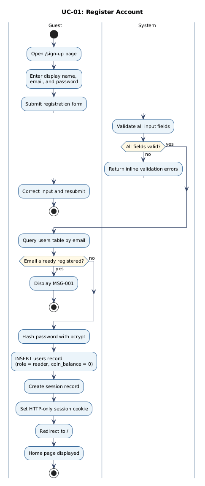{ width=6in }

1. Guest opens the registration page (`/sign-up`).
2. Guest enters a display name, email address, and password in the form fields.
3. Guest submits the form.
4. System validates all input fields against the defined business rules.
5. System checks the `users` table for an existing account with the same email.
6. If the email is already registered, the system returns an inline error and halts.
7. System hashes the password using bcrypt.
8. System inserts a new `users` record with `role = reader`, `coin_balance = 0`, `createdAt = now()`.
9. System creates an authenticated session and sets the session cookie.
10. System redirects the user to `/` (home page).

#### Business Rules

| Activity | BR Code | Description |
|---|---|---|
| (4) | BR-01-1 | **Validate Display Name:** On submit: `validateDisplayName(name)` &nbsp;&nbsp;// Checks: required, 1–100 chars, printable only, no leading/trailing whitespace &nbsp;&nbsp;if valid: proceed &nbsp;&nbsp;else: `MessageService.show(MSG-023)`, abort |
| (4) | BR-01-2 | **Validate Email Format:** On submit: `validateEmail(email)` &nbsp;&nbsp;// Checks: RFC 5322 pattern; normalised as `email.toLowerCase()` &nbsp;&nbsp;if valid: proceed &nbsp;&nbsp;else: `MessageService.show(MSG-023)`, abort |
| (4) | BR-01-3 | **Validate Password:** On submit: `validatePassword(password)` &nbsp;&nbsp;// Checks: minimum 8 characters, no maximum &nbsp;&nbsp;if valid: proceed &nbsp;&nbsp;else: `MessageService.show(MSG-015)`, abort |
| (5), (6) | BR-01-4 | **Email Uniqueness Check:** On lookup: `UserRepository.findByEmail(email.toLowerCase())` &nbsp;&nbsp;// DB unique index on `users.email` &nbsp;&nbsp;if not found: proceed to `UserRepository.create()` &nbsp;&nbsp;else: `MessageService.show(MSG-001)`, halt — `UserRepository.create()` never called |
| (8) | BR-01-5 | **Coin Initialisation:** On create: `UserRepository.create({ coinBalance: 0 })` &nbsp;&nbsp;// No `CoinTransactionRepository.create()` on registration &nbsp;&nbsp;Result: user starts with `coin_balance = 0` |
| (8) | BR-01-6 | **Default Role Assignment:** On create: `UserRepository.create({ role: 'reader' })` &nbsp;&nbsp;// Role elevated only by admin via `UserRepository.update({ role })` in UC-23 &nbsp;&nbsp;Result: user created with `role = 'reader'` |
| (10) | BR-01-7 | **Post-Registration Redirect:** On redirect: `RedirectService.redirect(callbackURL)` &nbsp;&nbsp;// `isSameOrigin(callbackURL)` — rejects any external URL &nbsp;&nbsp;if same origin: redirect to `callbackURL` &nbsp;&nbsp;else: redirect to `/` |

\pagebreak

---

### UC-02: Sign In with Email (FR-2.2)

| Field | Detail |
|---|---|
| **Name** | Sign In with Email |
| **Description** | A registered guest authenticates using their email address and password to access their account and personalized features. |
| **Actor** | Guest |
| **Trigger** | The guest navigates to `/sign-in` or clicks the "Đăng nhập" button. |
| **Pre-condition** | The guest is not currently authenticated. An account with the provided email exists and was created via email/password (not Google-only). |
| **Post-condition** | A new session is created and the session cookie is set. The user is redirected to the originally intended page or home page. |

#### Activities Flow

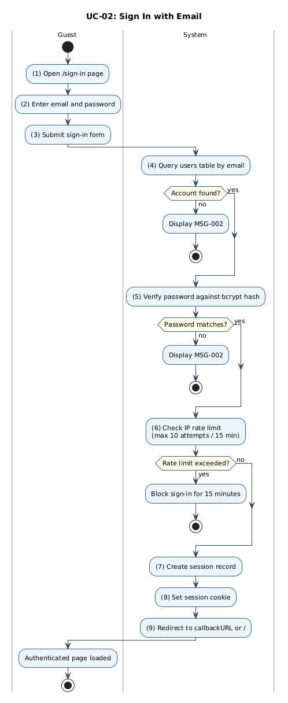{ width=6in }

1. Guest navigates to the sign-in page (`/sign-in`).
2. Guest enters their registered email address and password.
3. Guest submits the form.
4. System looks up the `users` table by the provided email.
5. System verifies the provided password against the stored bcrypt hash.
6. System checks IP rate limit (max 10 failed attempts per 15 minutes).
7. If verification succeeds, the system creates a session record.
8. System sets the session cookie on the response.
9. System redirects the user to the `callbackURL` query parameter (if same-origin) or to `/`.

#### Business Rules

| Activity | BR Code | Description |
|---|---|---|
| (4) | BR-02-1 | **Account Lookup:** On lookup: `UserRepository.findByEmail(email.toLowerCase())` &nbsp;&nbsp;// Same message used whether email is missing or password is wrong (prevents enumeration) &nbsp;&nbsp;if found: proceed to password check &nbsp;&nbsp;else: `MessageService.show(MSG-002)`, halt |
| (5) | BR-02-2 | **Password Verification:** On verify: `AuthService.verifyPassword(password, user.passwordHash)` — bcrypt compare &nbsp;&nbsp;if match: proceed to session creation &nbsp;&nbsp;else: `MessageService.show(MSG-002)`, halt |
| (6) | BR-02-3 | **Rate Limit + Session TTL:** On check: `RateLimiter.check(ip, { max: 10, window: 900 })` &nbsp;&nbsp;if within limit: `SessionService.create(userId, { ttl: rememberMe ? 2592000 : 86400 })` &nbsp;&nbsp;else: block IP for 15 min |
| (9) | BR-02-4 | **Redirect After Sign-In:** On redirect: `RedirectService.redirect(callbackURL)` &nbsp;&nbsp;// `isSameOrigin(callbackURL)` — rejects any external URL &nbsp;&nbsp;if same origin: redirect to `callbackURL` &nbsp;&nbsp;else: redirect to `/` |
| (6) | BR-02-5 | **Rate Limit Enforcement:** On exceeded: `RateLimiter.check()` returns exceeded &nbsp;&nbsp;Result: `MessageService.show(MSG-018)` &nbsp;&nbsp;// No session or cookie created; further attempts blocked for 15 min |

\pagebreak

---

### UC-03: Sign In with Google (FR-2.3)

| Field | Detail |
|---|---|
| **Name** | Sign In with Google |
| **Description** | A guest authenticates using their Google account via OAuth 2.0. The system creates or links a NovelHub account automatically. |
| **Actor** | Guest, Google OAuth |
| **Trigger** | The guest clicks "Tiếp tục với Google" on the sign-in page (`/sign-in`) or sign-up page (`/sign-up`). |
| **Pre-condition** | The guest is not authenticated. The Google OAuth client ID and secret are configured. |
| **Post-condition** | A NovelHub account is created (if new) or matched (if existing). An authenticated session is created and the user is redirected to `/`. |

#### Activities Flow

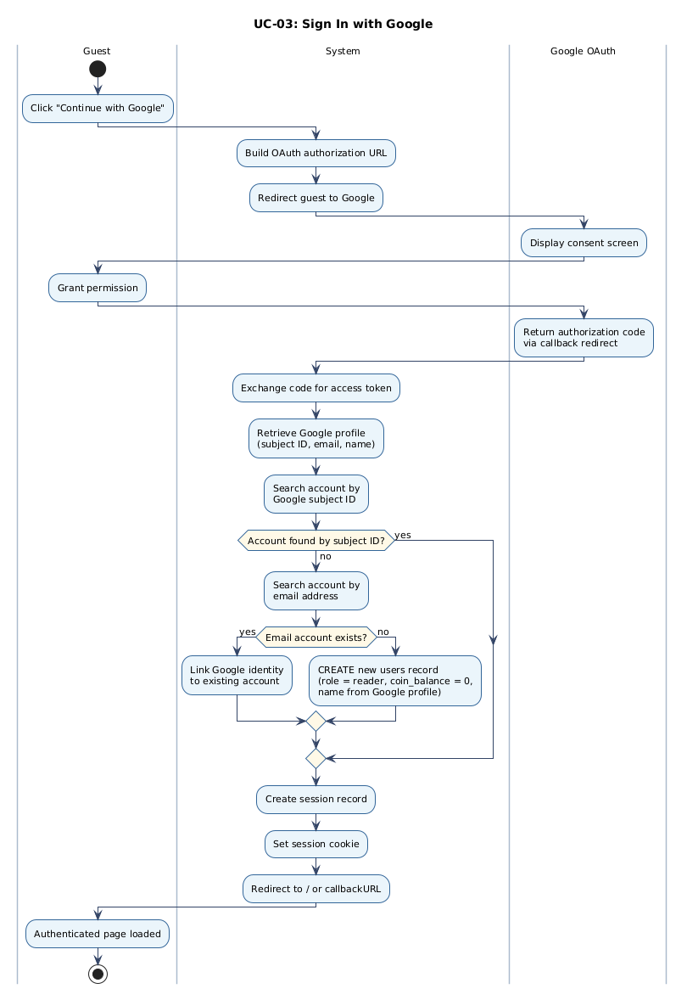{ width=6in }

1. Guest clicks "Tiếp tục với Google".
2. System constructs the Google OAuth authorization URL and redirects the guest.
3. Guest views the Google consent screen and grants permission.
4. Google redirects the guest back to the NovelHub callback URL with an authorization code.
5. System exchanges the authorization code for an access token via the Google token endpoint.
6. System retrieves the user's Google profile (subject ID, email, display name).
7. System checks whether an account exists with the matching Google subject ID.
8. If no subject ID match: system checks for an existing account with the same email address.
9. If an existing email/password account is found: system links the Google identity to that account (`accounts` table insert).
10. If no existing account is found: system creates a new `users` record with `role = reader`, `coin_balance = 0`, display name from Google profile.
11. System creates a session and redirects the user to `/` or the stored `callbackURL`.

#### Business Rules

| Activity | BR Code | Description |
|---|---|---|
| (8), (9) | BR-03-1 | **Account Linking:** On lookup: `AccountRepository.findByEmail(googleProfile.email)` &nbsp;&nbsp;if found: `AccountRepository.linkGoogle(userId, googleSubjectId)` &nbsp;&nbsp;// Linking is silent; user is not prompted &nbsp;&nbsp;else: continue to account creation check |
| (8), (10), (11) | BR-03-2 | **No Duplicate Accounts:** On check: `UserRepository.findByEmail(googleProfile.email)` &nbsp;&nbsp;// DB unique index on `users.email` &nbsp;&nbsp;if found: link Google identity; do not create new user &nbsp;&nbsp;else: `UserRepository.create()` — two accounts for same email never created |
| (10) | BR-03-3 | **Display Name Source:** On create: `UserRepository.create({ name: googleProfile.name, role: 'reader', coinBalance: 0 })` &nbsp;&nbsp;// User can update name later via `UserRepository.update({ name })` in UC-19 |
| (10) | BR-03-4 | **No Password for Google Accounts:** On create: `UserRepository.create()` called without `passwordHash` &nbsp;&nbsp;`AuthService.hasPassword(userId)` returns false &nbsp;&nbsp;// "Đổi mật khẩu" section hidden in Server Component based on `hasPassword()` |
| (2), (5) | BR-03-5 | **OAuth Failure Handling:** On error: `GoogleOAuthService.exchangeCode(code)` throws or user cancels &nbsp;&nbsp;Result: `MessageService.show(MSG-003)` &nbsp;&nbsp;`RedirectService.redirect('/sign-in')` &nbsp;&nbsp;// No user record created |

\pagebreak

---

### UC-04: Sign Out (FR-2.4)

| Field | Detail |
|---|---|
| **Name** | Sign Out |
| **Description** | An authenticated user explicitly ends their current session, clearing their authentication state from the browser and server. |
| **Actor** | Reader, Curator, Admin |
| **Trigger** | The user selects "Đăng xuất" from the user account dropdown menu in the navigation bar. |
| **Pre-condition** | The user is currently authenticated (has a valid session cookie). |
| **Post-condition** | The session record is removed from the `sessions` table. The session cookie is cleared. The user is redirected to the home page (`/`) as a guest. |

#### Activities Flow

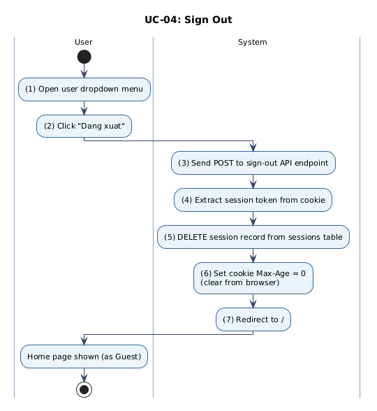{ width=5in }

1. User opens the user dropdown menu in the navigation bar.
2. User selects "Đăng xuất".
3. System sends a POST request to the sign-out API endpoint.
4. System retrieves the session token from the cookie.
5. System deletes the session record from the `sessions` table.
6. System sets the session cookie to an expired value (clearing it from the browser).
7. System redirects the user to `/`.

#### Business Rules

| Activity | BR Code | Description |
|---|---|---|
| (5) | BR-04-1 | **Session Invalidation:** On sign-out: `SessionRepository.delete(sessionToken)` &nbsp;&nbsp;// Removes row from `sessions` table immediately &nbsp;&nbsp;Result: old cookie → `SessionService.validate()` returns null → user is unauthenticated |
| (6) | BR-04-2 | **Cookie Clearing:** On clear: `CookieService.clear('better-auth.session', { maxAge: 0, expires: new Date(0) })` &nbsp;&nbsp;// `Max-Age=0` instructs browser to delete the cookie immediately |
| (7) | BR-04-3 | **Redirect Destination:** On redirect: `RedirectService.redirect('/')` &nbsp;&nbsp;// Always redirects to home &nbsp;&nbsp;// Never redirects to a previously visited protected page |
| (2) | BR-04-4 | **No Confirmation Prompt:** On click: `SessionRepository.delete()` is called immediately, no dialog shown &nbsp;&nbsp;// Action is irreversible upon click at activity (2) |

\pagebreak

---

### UC-05: Reset Password (FR-2.5)

| Field | Detail |
|---|---|
| **Name** | Reset Password |
| **Description** | A user who has forgotten their password requests a one-time reset link sent to their registered email address, then uses that link to set a new password. |
| **Actor** | Guest, Reader |
| **Trigger** | The user clicks "Quên mật khẩu?" on the sign-in page. |
| **Pre-condition** | The user has an email/password account (not a Google-only account). |
| **Post-condition** | A time-limited reset token is emailed to the user. After the user sets a new password via the link, the password is updated and all other sessions are invalidated. |

#### Activities Flow

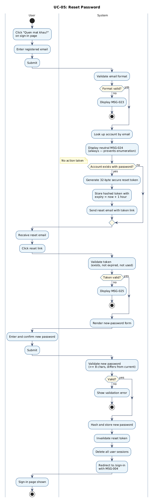{ width=6in }

1. User clicks "Quên mật khẩu?" on the sign-in page.
2. System renders the forgot-password form.
3. User enters their registered email address and submits.
4. System validates the email format.
5. System performs a database lookup for the email.
6. Regardless of whether the email is found, system displays a neutral confirmation message (MSG-024) to prevent enumeration.
7. If the email is found: system generates a cryptographically secure reset token, stores a hashed version with an expiry timestamp in the `verifications` table.
8. System sends a transactional email containing the reset link (`/reset-password?token=<token>`).
9. User clicks the reset link from their email client.
10. System validates the token: checks it exists, has not expired, and has not been used.
11. If invalid: system shows an error (MSG-025) and offers a "Gửi lại" option.
12. If valid: system renders the new-password form.
13. User enters and confirms a new password and submits.
14. System validates the new password.
15. System updates the password hash in the `users` table.
16. System marks the token as used and removes it from the `verifications` table.
17. System invalidates all existing sessions for the user.
18. System redirects to `/sign-in` with MSG-004.

#### Business Rules

| Activity | BR Code | Description |
|---|---|---|
| (5), (6) | BR-05-1 | **Email Enumeration Prevention:** On lookup: `UserRepository.findByEmail(email)` — result never disclosed &nbsp;&nbsp;// `MessageService.show(MSG-024)` called unconditionally &nbsp;&nbsp;// whether or not the account exists |
| (7), (8) | BR-05-2 | **Token Security:** On generate: `TokenService.generate()` → 32-byte URL-safe random string &nbsp;&nbsp;On store: `TokenRepository.store({ hash: sha256(token), userId, expiresAt })` &nbsp;&nbsp;// Raw token never persisted; only sha256 hash stored |
| (7), (8) | BR-05-3 | **Token Expiry:** On store: `TokenRepository.store({ expiresAt: Date.now() + 3600000 })` &nbsp;&nbsp;// Expires in 1 hour &nbsp;&nbsp;On validate: `TokenService.validate(token)` → `TokenRepository.findByHash(sha256(token))` &nbsp;&nbsp;// Checks: `expiresAt > now()` |
| (11), (17) | BR-05-4 | **Single-Use Token:** On success: `AuthService.updatePassword()` completes &nbsp;&nbsp;→ `TokenRepository.delete(tokenId)` &nbsp;&nbsp;if token missing: `TokenService.validate()` fails → `MessageService.show(MSG-025)` |
| (15) | BR-05-5 | **New Password Constraints:** On validate: `validatePassword(newPassword)` — min 8 chars &nbsp;&nbsp;if too short: `MessageService.show(MSG-015)` &nbsp;&nbsp;On check: `AuthService.isDifferentPassword(newPassword, user.passwordHash)` &nbsp;&nbsp;if same as current: `MessageService.show(MSG-017)` |
| (3), (5) | BR-05-6 | **Google-Only Account Exclusion:** On check: `UserRepository.hasPassword(userId)` — returns false when `passwordHash` is null &nbsp;&nbsp;// "Quên mật khẩu?" link hidden server-side &nbsp;&nbsp;if direct endpoint call: `MessageService.show(MSG-018)`, no token generated |

\pagebreak

---

### UC-06: Browse Novel List (FR-3.1)

| Field | Detail |
|---|---|
| **Name** | Browse Novel List |
| **Description** | A visitor browses the complete catalogue of available novels, which can be sorted and filtered. The page is server-side rendered for SEO and initial performance. |
| **Actor** | Guest, Reader |
| **Trigger** | The user navigates to `/novels` or clicks "Thể loại" in the navigation bar. |
| **Pre-condition** | None. The page is publicly accessible. |
| **Post-condition** | The novel list page is displayed, reflecting the current filter/sort state encoded in the URL query parameters. |

#### Activities Flow

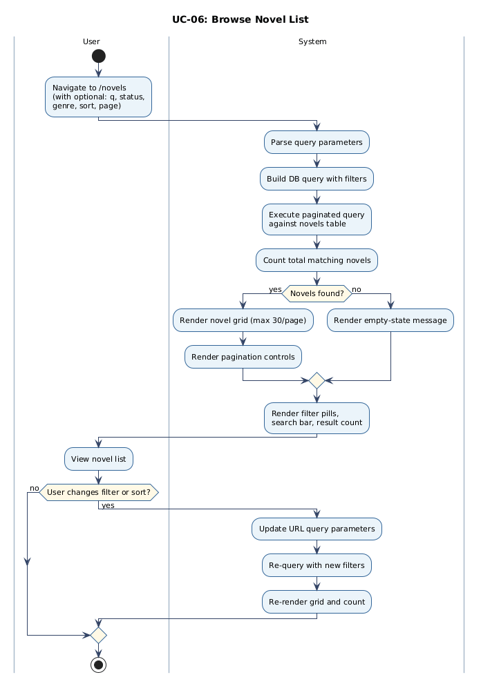{ width=6in }

1. User navigates to `/novels` (with optional query parameters: `q`, `status`, `genre`, `sort`, `page`).
2. System parses the query parameters and builds the database query with any active filters.
3. System executes a paginated query against the `novels` table.
4. System counts the total number of matching novels for the result counter.
5. System renders the page with: the search bar, status filter pills, genre filter pills, result count, and the novel grid.
6. User views the rendered novel list.
7. User optionally interacts with filters or the search bar (handled by UC-07 and UC-08).
8. Filter changes update the URL and trigger a new page render (client-side navigation with server revalidation).

#### Business Rules

| Activity | BR Code | Description |
|---|---|---|
| (2), (3) | BR-06-1 | **Default Sort:** On parse: `QueryParser.parseSort(sort)` — defaults to `'updatedAt'` when param absent &nbsp;&nbsp;`NovelRepository.findAll({ sort: 'updatedAt', order: 'desc' })` |
| (2) | BR-06-2 | **Available Sort Options:** On parse: `QueryParser.parseSort(sort)` &nbsp;&nbsp;// Accepts: `'updatedAt'`, `'trending'`, `'rating'`, `'chapters'` &nbsp;&nbsp;if unknown value: fall back to `'updatedAt'` |
| (3), (4) | BR-06-3 | **Pagination:** On query: `NovelRepository.findAll({ limit: 30, offset: (page - 1) * 30 })` &nbsp;&nbsp;// Pagination controls render when `totalCount > 30` |
| (2) | BR-06-4 | **Status Filter Values:** On parse: `QueryParser.parseStatus(status)` &nbsp;&nbsp;// Accepts: `'ONGOING'`, `'COMPLETED'`, `'HIATUS'`, `'DROPPED'` &nbsp;&nbsp;if absent or unknown: no status filter applied |
| (2) | BR-06-5 | **Single Genre Filter:** On parse: `QueryParser.parseGenre(genre)` — returns at most one genre ID &nbsp;&nbsp;if multiple params: only first is applied |
| (5), (6) | BR-06-6 | **Empty Results:** On count: `NovelRepository.count(filters)` returns 0 &nbsp;&nbsp;→ `EmptyStateComponent.render({ message: 'Không tìm thấy truyện', link: '/novels' })` &nbsp;&nbsp;// No novel grid rendered |
| (1), (8) | BR-06-7 | **URL State:** On filter change: `URLService.encode({ q, status, genre, sort, page })` &nbsp;&nbsp;// Sharing or reloading URL restores identical view |

\pagebreak

---

### UC-07: Search Novels (FR-3.2)

| Field | Detail |
|---|---|
| **Name** | Search Novels |
| **Description** | A visitor searches for novels by typing a keyword. The search is powered by Meilisearch for ranked, typo-tolerant results. |
| **Actor** | Guest, Reader |
| **Trigger** | The user types in the search input on the novel browse page (`/novels`) or clicks the search icon in the navigation bar. |
| **Pre-condition** | None. |
| **Post-condition** | The novel list is updated to show only novels whose title or synopsis matches the search query. The `q` query parameter in the URL is updated. |

#### Activities Flow

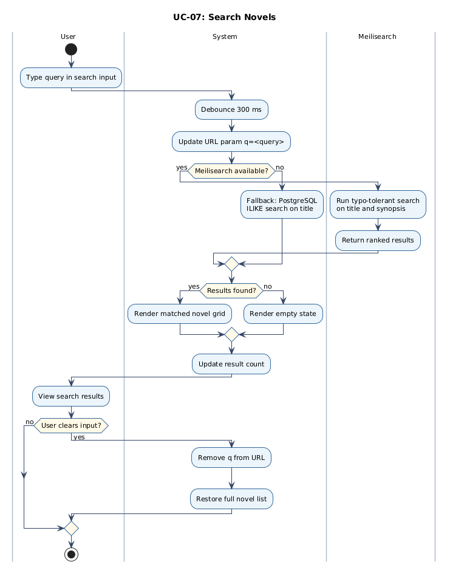{ width=6in }

1. User focuses the search input and begins typing.
2. System debounces the input for 300 ms.
3. After debounce, system updates the `q` query parameter in the URL via client-side navigation.
4. System sends a search request to the Meilisearch index with the query string.
5. Meilisearch returns ranked results (by relevance score), including highlighted matches.
6. System renders the matching novel grid.
7. The result count updates to reflect the number of matched novels.
8. If the user clears the search input, the `q` parameter is removed and the full list is restored.

#### Business Rules

| Activity | BR Code | Description |
|---|---|---|
| (1), (2) | BR-07-1 | **Minimum Query Length:** On input: `if (query.trim().length === 0)` → skip &nbsp;&nbsp;// `SearchService.search()` not called &nbsp;&nbsp;Result: empty query removes `q` from URL and restores full list |
| (2) | BR-07-2 | **Debounce:** On keystroke: `Debounce.delay(handleInput, 300)` — waits 300 ms after last keystroke &nbsp;&nbsp;// Prevents excessive API calls per keystroke |
| (4) | BR-07-3 | **Search Scope:** On search: `MeilisearchService.search(query, { attributesToSearchOn: ['title', 'synopsis'] })` &nbsp;&nbsp;// Tags and genre names are excluded from the index |
| (4) | BR-07-4 | **Typo Tolerance:** On search: `MeilisearchService.search()` with `typoTolerance: { enabled: true }` &nbsp;&nbsp;// Up to 2 edits for words > 8 characters; no extra config needed |
| (4) | BR-07-5 | **Fallback Search:** On error: `try { MeilisearchService.search(query) } catch { NovelRepository.searchFallback(query) }` &nbsp;&nbsp;// Fallback query: `WHERE title ILIKE '%query%'` on `title` field only |
| (4) | BR-07-6 | **Combined Filters:** On search: `SearchService.search(query, { status, genre })` — all conditions AND-ed &nbsp;&nbsp;// Status and genre applied in same Meilisearch request via `filter` param |

\pagebreak

---

### UC-08: Filter Novels (FR-3.3)

| Field | Detail |
|---|---|
| **Name** | Filter Novels |
| **Description** | A visitor refines the novel catalogue by selecting a publication status or genre from the filter pill UI. |
| **Actor** | Guest, Reader |
| **Trigger** | The user clicks a status pill (e.g., "Đang ra") or a genre pill on the `/novels` browse page. |
| **Pre-condition** | The user is on the `/novels` page. |
| **Post-condition** | The URL query parameters are updated with the selected filter(s), and the novel grid is re-rendered to show only matching novels. |

#### Activities Flow

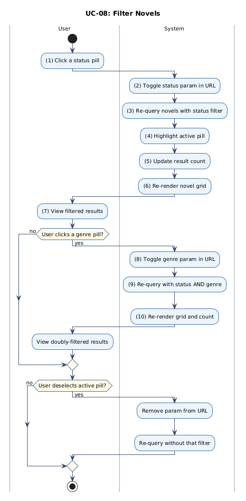{ width=6in }

1. User clicks a status pill (e.g., "Hoàn thành").
2. System updates the `status` query parameter in the URL.
3. System triggers a navigation to the updated URL (client-side).
4. Server re-fetches the novel list with the status filter applied.
5. The clicked pill is visually highlighted as active; all other status pills appear inactive.
6. The result count updates to reflect the number of matching novels.
7. User optionally also clicks a genre pill.
8. System adds the `genre` query parameter to the URL.
9. Novel list is re-rendered with both status and genre filters active simultaneously.
10. User can deselect an active filter by clicking the same pill again.

#### Business Rules

| Activity | BR Code | Description |
|---|---|---|
| (1), (2) | BR-08-1 | **Single Status Selection:** On toggle: `URLService.toggleParam('status', value)` &nbsp;&nbsp;if same value active: removes param (deselects) &nbsp;&nbsp;// Only one status value allowed at a time |
| (7), (8) | BR-08-2 | **Single Genre Selection:** On toggle: `URLService.toggleParam('genre', genreId)` &nbsp;&nbsp;if same value active: removes param (deselects) &nbsp;&nbsp;// Only one genre ID allowed in URL at a time |
| (2), (8) | BR-08-3 | **Filter Persistence in URL:** On toggle: `URLService.encode({ status, genre, q, sort, page })` &nbsp;&nbsp;// Sharing or reloading URL restores identical view |
| (5), (10) | BR-08-4 | **Result Count Display:** On count: `NovelRepository.count({ status, genre, q })` returns total &nbsp;&nbsp;Result: rendered as `"{n} truyện"` in muted text above the novel grid |
| (3), (9) | BR-08-5 | **Combined with Search:** On query: `NovelRepository.findAll({ status, genre, q })` — all conditions AND-ed &nbsp;&nbsp;// Single DB query handles status, genre, and search simultaneously |

\pagebreak

---

### UC-09: View Novel Detail (FR-3.4)

| Field | Detail |
|---|---|
| **Name** | View Novel Detail |
| **Description** | A visitor views the full detail page for a novel, including the hero section with metadata and CTAs, synopsis, tags, reviews, chapter list, and recommendations. |
| **Actor** | Guest, Reader |
| **Trigger** | The user clicks on a novel card or navigates directly to `/novels/[slug]`. |
| **Pre-condition** | A published novel with the given slug exists in the database. |
| **Post-condition** | The novel detail page is rendered. The novel's `totalViews` counter is incremented by 1. If the user is authenticated, the "Tiếp tục đọc" CTA is populated with their last-read chapter. |

#### Activities Flow

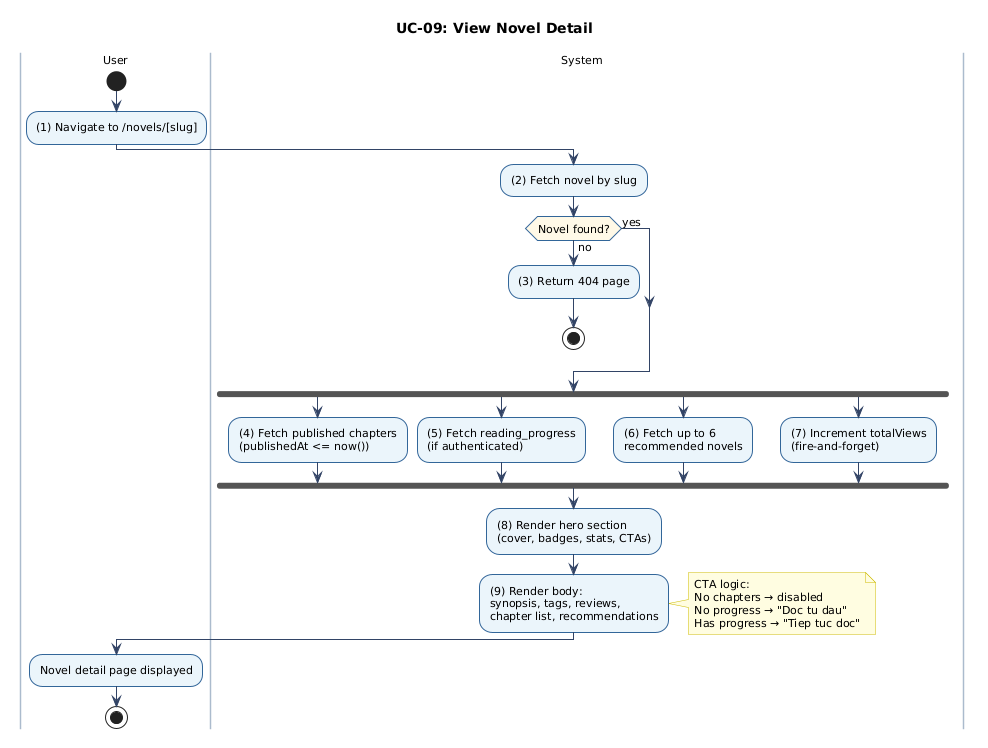{ width=6in }

1. User navigates to `/novels/[slug]`.
2. System fetches the novel record by slug.
3. If no novel is found, the system renders a 404 page.
4. System fetches the published chapter list for the novel (only chapters with `publishedAt <= now()`).
5. If the user is authenticated, system fetches their `reading_progress` record for this novel (last-read chapter number).
6. System fetches up to 6 recommended novels (same genres, excluding the current novel).
7. System triggers a fire-and-forget increment of `novels.totalViews`.
8. System renders the page:
   - **Hero section**: blurred cover background, cover image, title, status/language/genre badges, stats (chapter count, views, rating), CTA buttons, follow button.
   - **Body**: synopsis, tag badges, reviews section (UC-15), chapter list with VIP lock icons, recommendations grid.
9. CTA logic:
   - If no chapters exist: "Chưa có chương" (disabled).
   - If chapters exist but no progress: "Đọc từ đầu" (links to first chapter).
   - If progress exists: "Tiếp tục đọc" + "Từ đầu" (links to last-read chapter and first chapter respectively).

#### Business Rules

| Activity | BR Code | Description |
|---|---|---|
| (2), (3) | BR-09-1 | **Slug Uniqueness:** On lookup: `NovelRepository.findBySlug(slug)` &nbsp;&nbsp;// DB unique index on `novels.slug` &nbsp;&nbsp;if null: `NotFoundService.render404()` — HTTP 404 &nbsp;&nbsp;else: render novel detail page |
| (7) | BR-09-2 | **View Counter (Fire-and-Forget):** On page load: `ViewCountService.increment(novelId)` — called without `await` &nbsp;&nbsp;// Runs as detached promise &nbsp;&nbsp;// Must never block the page response |
| (4) | BR-09-3 | **Published Chapters Only:** On fetch: `ChapterRepository.findPublished(novelId)` &nbsp;&nbsp;// Filters: `WHERE publishedAt IS NOT NULL AND publishedAt <= now()` &nbsp;&nbsp;// Drafts and future-scheduled chapters excluded |
| (8), (9) | BR-09-4 | **VIP Indicators:** On render: `ChapterListItem.render({ chapter })` &nbsp;&nbsp;// Shows amber lock icon when `chapter.isVip === true` &nbsp;&nbsp;// Shown regardless of user's access level |
| (6) | BR-09-5 | **Recommendations:** On fetch: `NovelRepository.findRecommended(novelId, genreIds, { limit: 6 })` &nbsp;&nbsp;// Shares ≥1 genre, excludes current novel &nbsp;&nbsp;// Sorted by `totalViews DESC` |
| (8) | BR-09-6 | **Rating Display:** On render: `ReviewService.getAverageRating(novelId)` &nbsp;&nbsp;if null (no reviews): rating not displayed &nbsp;&nbsp;else: rendered as `avgRating.toFixed(1)` (e.g., `4.7`) |

\pagebreak

---

### UC-10: Read Chapter (FR-3.5)

| Field | Detail |
|---|---|
| **Name** | Read Chapter |
| **Description** | A user reads the text content of a specific published chapter. VIP chapters require a prior coin unlock or an active subscription. The content is never exposed server-side to unauthorized users. |
| **Actor** | Guest, Reader |
| **Trigger** | The user clicks a chapter row in the chapter list or uses the prev/next navigation in the chapter reader. |
| **Pre-condition** | A published chapter with the given number exists for the novel. |
| **Post-condition** | The chapter content is rendered. If authenticated, a `reading_progress` record is upserted. |

#### Activities Flow

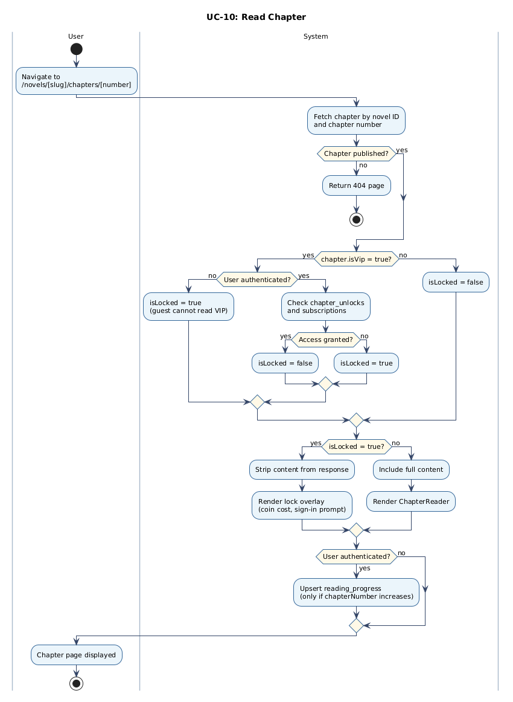{ width=6in }

1. User navigates to `/novels/[slug]/chapters/[number]`.
2. System fetches the chapter record by novel ID and chapter number.
3. If no matching published chapter is found, the system returns 404.
4. System evaluates access:
   - If `chapter.isVip = false`: access is granted unconditionally.
   - If `chapter.isVip = true` and user is not authenticated: access is denied; `isLocked = true`.
   - If `chapter.isVip = true` and user is authenticated: system checks `chapter_unlocks` and `subscriptions` tables.
5. If access is denied: the server strips the `content` field before sending the response. The `ChapterReader` component renders the locked overlay.
6. If access is granted: the full `content` is included in the server response.
7. System renders the `ChapterReader` component with the chapter content, adjacent chapter links, and all-chapters dropdown.
8. If authenticated: system upserts a `reading_progress` record: `userId`, `novelId`, `chapterId`, `updatedAt = now()`.

#### Business Rules

| Activity | BR Code | Description |
|---|---|---|
| (4) | BR-10-1 | **VIP Access Check:** On check: `AccessService.checkVip(userId, chapterId)` &nbsp;&nbsp;if `ChapterUnlockRepository.exists(userId, chapterId)`: `isLocked = false` &nbsp;&nbsp;else if `SubscriptionRepository.findActive(userId, { now })` non-null: `isLocked = false` &nbsp;&nbsp;else: `isLocked = true` |
| (5) | BR-10-2 | **Server-Side Content Stripping:** On response: `if (isLocked) { chapter.content = null }` &nbsp;&nbsp;// In Server Component before response &nbsp;&nbsp;// Content omitted from payload entirely; never hidden via CSS |
| (4), (5) | BR-10-3 | **Guest VIP Handling:** On access: `!userId && chapter.isVip` → `isLocked = true` &nbsp;&nbsp;`ChapterReader.renderLockedOverlay({ signInUrl })` &nbsp;&nbsp;// No redirect; metadata still visible |
| (7) | BR-10-4 | **Reading Progress Update:** On chapter load: `ReadingProgressRepository.upsert(userId, novelId, chapterId, { onlyIfGreater: true })` &nbsp;&nbsp;// Updates only when `newChapterNumber >= storedChapterNumber` |
| (8) | BR-10-5 | **Reading Time Display:** On render: `ReadingTimeService.estimate(wordCount)` → `Math.ceil(wordCount / 250)` minutes &nbsp;&nbsp;// Shown in reader top bar (e.g., "~12 phút đọc") |
| (6) | BR-10-6 | **Chapter Navigation:** On fetch: `ChapterNavigationService.getAdjacent(novelId, chapterNumber)` → `{ prev, next }` &nbsp;&nbsp;if `prev === null`: prev button hidden &nbsp;&nbsp;if `next === null`: next button hidden |

\pagebreak

---

### UC-11: Adjust Reader Settings (FR-3.6)

| Field | Detail |
|---|---|
| **Name** | Adjust Reader Settings |
| **Description** | A reader opens the settings panel in the chapter reader and customises the visual reading experience — theme, font family, font size, line height, and content width. Changes take effect immediately and are persisted in the browser's local storage. |
| **Actor** | Reader |
| **Trigger** | The user clicks the gear icon (settings) in the chapter reader's fixed top bar. |
| **Pre-condition** | The user is on the chapter reader page (`/novels/[slug]/chapters/[number]`). |
| **Post-condition** | The selected settings are applied to the reading area in real time. Settings are saved to `localStorage` under the key `reader-settings`. |

#### Activities Flow

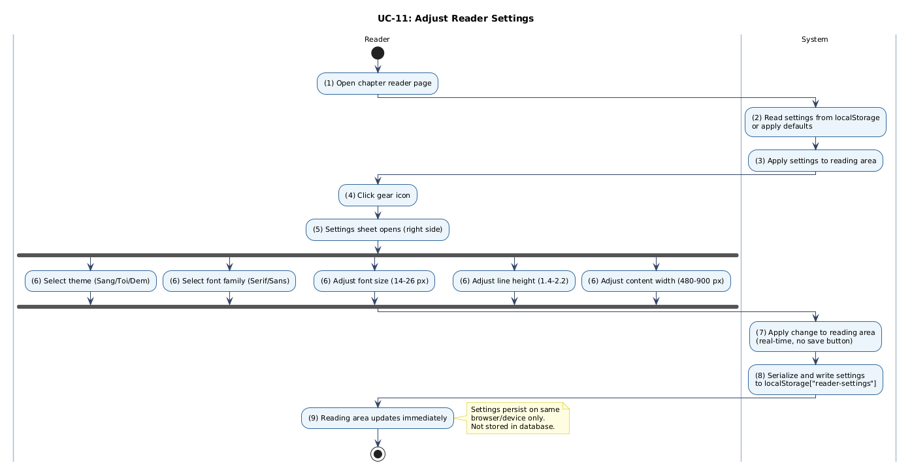{ width=6in }

1. User clicks the gear icon; a settings sheet slides in from the right.
2. User selects a reading theme by clicking one of three theme buttons: **Sáng**, **Tối**, or **Đêm**.
   - Sáng: background `#faf9f6`, text `#27272a`.
   - Tối: background `#212121`, text `#e4e4e7`.
   - Đêm: background `#0f0f0f`, text `#a1a1aa`.
3. User selects a font family: **Serif** (Lora, italic) or **Sans** (Inter).
4. User adjusts the font size slider (range: 14–26 px, step: 1).
5. User adjusts the line height slider (range: 1.4–2.2, step: 0.1).
6. User adjusts the content width slider (range: 480–900 px, step: 10).
7. Each change is applied immediately to the reading area without a save button.
8. Settings are serialized to JSON and written to `localStorage['reader-settings']` on every change.
9. On page load, settings are read from `localStorage` and applied before the first paint (no flash).

#### Business Rules

| Activity | BR Code | Description |
|---|---|---|
| (2) | BR-11-1 | **Default Settings:** On load: `ReaderSettingsService.getDefaults()` &nbsp;&nbsp;// Returns: `{ theme: 'dark', font: 'serif', fontSize: 18, lineHeight: 1.85, contentWidth: 680 }` &nbsp;&nbsp;// Applied when `LocalStorageService.get('reader-settings')` returns null |
| (8) | BR-11-2 | **Persistence Scope:** On change: `LocalStorageService.set('reader-settings', JSON.stringify(settings))` &nbsp;&nbsp;// `UserRepository.update()` never called — no cross-device sync |
| (7) | BR-11-3 | **Theme Independence:** On apply: `ReaderSettingsService.applyTheme(theme)` &nbsp;&nbsp;// CSS variables applied to `.chapter-content` only &nbsp;&nbsp;// Site-wide theme (`document.documentElement`) is unaffected |
| (8) | BR-11-4 | **No Server Storage:** On save: `ReaderSettingsService.save(settings)` calls only `LocalStorageService.set()` &nbsp;&nbsp;// No `UserRepository.update()` or API call is ever made |

\pagebreak

---

### UC-12: Follow Novel (FR-4.1)

| Field | Detail |
|---|---|
| **Name** | Follow Novel |
| **Description** | A reader toggles their follow status on a novel to receive notifications when new chapters are published. The follow state is reflected immediately in the button UI. |
| **Actor** | Reader |
| **Trigger** | The reader clicks the "Theo dõi" or "Đang theo dõi" button on the novel detail page. |
| **Pre-condition** | The user is authenticated. The novel exists. |
| **Post-condition** | A `novel_follows` record is created (follow) or deleted (unfollow). The button label and state update to reflect the new status. |

#### Activities Flow

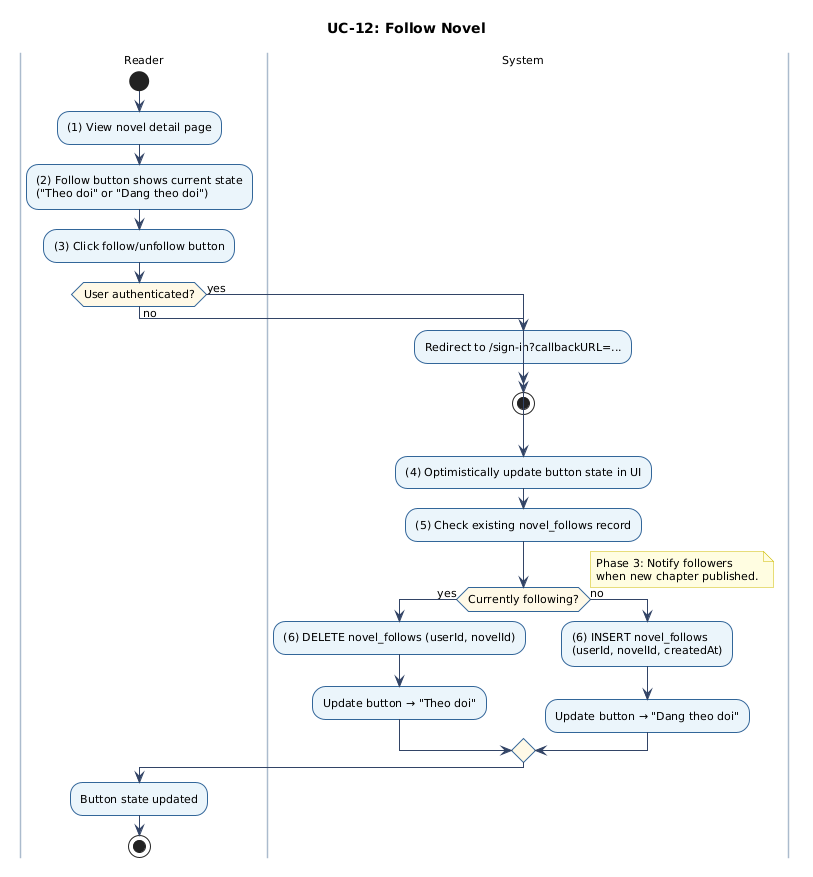{ width=5in }

1. Reader views the novel detail page.
2. The follow button displays "Theo dõi" if not following, or "Đang theo dõi" if already following.
3. Reader clicks the button.
4. **If currently not following:**
   - System inserts a `novel_follows` record (`userId`, `novelId`, `createdAt`).
   - Button changes to "Đang theo dõi" with a different visual style.
5. **If currently following:**
   - System deletes the matching `novel_follows` record.
   - Button reverts to "Theo dõi".
6. The follow/unfollow action is optimistic — the UI updates immediately and the server is called asynchronously.

#### Business Rules

| Activity | BR Code | Description |
|---|---|---|
| (3) | BR-12-1 | **Authentication Required:** On click: `AuthService.isAuthenticated(request)` &nbsp;&nbsp;if authenticated: proceed to follow/unfollow &nbsp;&nbsp;else: `RedirectService.redirectToSignIn('/novels/[slug]')` — `NovelFollowRepository` never called |
| (5), (6) | BR-12-2 | **Idempotency:** On follow: `NovelFollowRepository.insert(userId, novelId)` — `INSERT ... ON CONFLICT DO NOTHING` &nbsp;&nbsp;On unfollow: `NovelFollowRepository.delete(userId, novelId)` — safe to call multiple times |
| (6) | BR-12-3 | **Notification Integration (Phase 3):** On publish: `NotificationQueue.add({ type: 'new_chapter', novelId, followerId })` per follower &nbsp;&nbsp;// Uses `NovelFollowRepository.findFollowersByNovel(novelId)` to fan out |

\pagebreak

---

### UC-13: Track Reading Progress (FR-4.2)

| Field | Detail |
|---|---|
| **Name** | Track Reading Progress |
| **Description** | The system automatically records and maintains the reader's last-read chapter for each novel. This enables the "Tiếp tục đọc" CTA on the novel detail page and the progress bar in the library. |
| **Actor** | Reader |
| **Trigger** | An authenticated reader opens any accessible chapter page. |
| **Pre-condition** | The user is authenticated. The chapter is accessible (not locked, or already unlocked). |
| **Post-condition** | The `reading_progress` record for the (userId, novelId) pair is upserted with the current `chapterId` and `updatedAt = now()`. |

#### Activities Flow

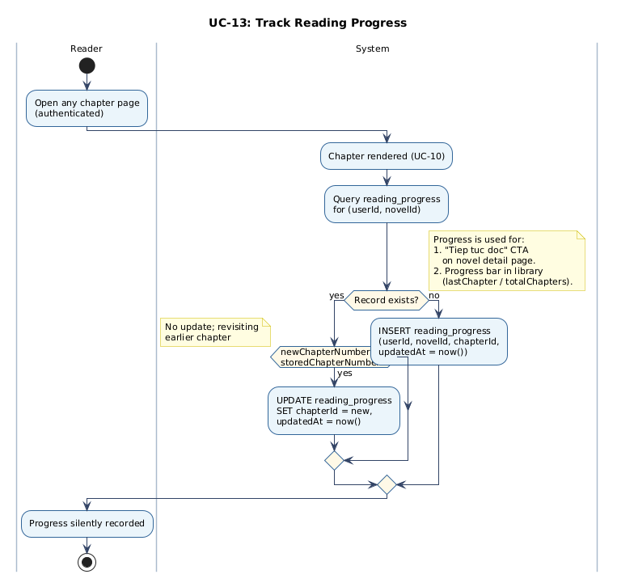{ width=6in }

1. Authenticated reader opens a chapter page (UC-10).
2. System checks whether a `reading_progress` row exists for (userId, novelId).
3. **If no existing row:** system inserts a new record with `userId`, `novelId`, `chapterId`, `updatedAt`.
4. **If an existing row exists:** system updates the row only if the new `chapterNumber` is greater than or equal to the stored chapter number.
5. On the novel detail page, the CTA reads "Tiếp tục đọc chương [N]" using the stored chapter number.
6. In the library, a progress bar displays `(lastChapterNumber / totalChapters) × 100%`.

#### Business Rules

| Activity | BR Code | Description |
|---|---|---|
| (4) | BR-13-1 | **Forward-Only Progress:** On upsert: `ReadingProgressRepository.upsert(userId, novelId, chapterId)` &nbsp;&nbsp;// SQL: `INSERT ... ON CONFLICT DO UPDATE ... WHERE EXCLUDED.chapterNumber >= stored.chapterNumber` &nbsp;&nbsp;// Re-reading an earlier chapter never overwrites stored progress |
| (3), (4) | BR-13-2 | **One Record per Novel:** On upsert: `ReadingProgressRepository.upsert()` &nbsp;&nbsp;// DB unique constraint on `(userId, novelId)` &nbsp;&nbsp;// Always resolves to exactly one row per pair |
| (6) | BR-13-3 | **Progress Percentage:** On render: `ProgressService.calculate(lastChapterNumber, totalChapters)` &nbsp;&nbsp;// Returns: `Math.min(Math.round(n / total * 100), 100)` &nbsp;&nbsp;// Rendered as integer percentage in library progress bar |
| (1) | BR-13-4 | **Guest Exclusion:** On chapter load: `AuthService.isAuthenticated(request)` &nbsp;&nbsp;if authenticated: call `ReadingProgressRepository.upsert()` &nbsp;&nbsp;else: upsert skipped; no anonymous tracking |

\pagebreak

---

### UC-14: View Library (FR-4.3)

| Field | Detail |
|---|---|
| **Name** | View Library |
| **Description** | A reader views their personal reading library — a collection of novels they are following or have read — with filter tabs and reading progress indicators. |
| **Actor** | Reader |
| **Trigger** | The reader navigates to `/library` or clicks "Tủ sách" in the navigation bar. |
| **Pre-condition** | The user is authenticated. |
| **Post-condition** | The library page is displayed, showing the user's novels filtered by the selected tab (Đang đọc / Hoàn thành / Tất cả). |

#### Activities Flow

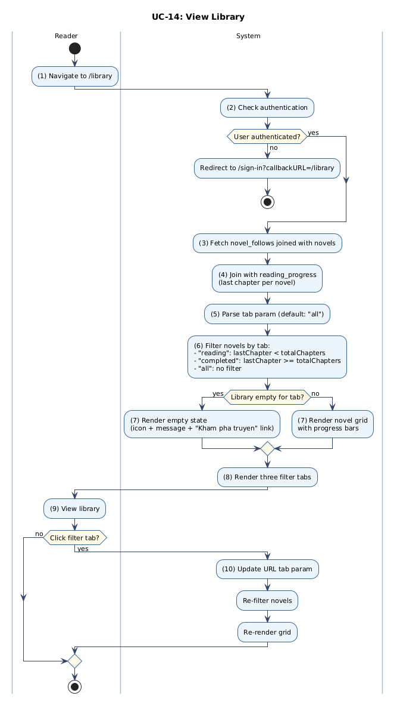{ width=6in }

1. Reader navigates to `/library`.
2. System verifies authentication; unauthenticated users are redirected to `/sign-in?callbackURL=/library`.
3. System fetches the user's followed novels from `novel_follows` joined with `novels`.
4. System joins with `reading_progress` to get the last-read chapter number for each novel.
5. System renders the page with three filter tabs: **Đang đọc**, **Hoàn thành**, **Tất cả**.
6. **Đang đọc**: novels where `readingProgress.lastChapterNumber < novel.totalChapters`.
7. **Hoàn thành**: novels where `readingProgress.lastChapterNumber >= novel.totalChapters`.
8. **Tất cả**: all followed novels regardless of progress.
9. Each novel card shows the cover, title, and a thin primary-color progress bar at the bottom.
10. If no novels match the current tab, an empty state is shown.

#### Business Rules

| Activity | BR Code | Description |
|---|---|---|
| (2) | BR-14-1 | **Protected Route:** On navigate: `MiddlewareService.protect('/library')` &nbsp;&nbsp;if authenticated: render library &nbsp;&nbsp;else: redirect to `/sign-in?callbackURL=/library` &nbsp;&nbsp;// Enforced at Next.js middleware before page renders |
| (7) | BR-14-2 | **Progress Bar:** On render: `ProgressBarComponent.render({ value: lastChapterNumber / totalChapters })` &nbsp;&nbsp;// Height 3 px, primary color &nbsp;&nbsp;// Percentage clamped via `ProgressService.calculate()` |
| (7) | BR-14-3 | **Empty State:** On check: `LibraryService.isEmpty(novels)` → true when filtered list is empty &nbsp;&nbsp;→ `EmptyStateComponent.render({ icon: BookOpen, message: 'Chưa có truyện nào', link: '/novels' })` |
| (5) | BR-14-4 | **Tab Default:** On parse: `URLService.parseTab(tab)` defaults to `'all'` when param absent &nbsp;&nbsp;`LibraryService.filterByTab(novels, tab)` applies filter &nbsp;&nbsp;// State stored as `?tab=reading` / `?tab=completed` |

\pagebreak

---

### UC-15: Write Review (FR-5.1)

| Field | Detail |
|---|---|
| **Name** | Write Review |
| **Description** | A reader submits a star rating (1–5) and an optional text review for a novel. Each reader can write at most one review per novel; submitting again updates the existing review. |
| **Actor** | Reader |
| **Trigger** | The reader clicks "Viết đánh giá" on the novel detail page's reviews section. |
| **Pre-condition** | The user is authenticated. The novel exists. |
| **Post-condition** | A `reviews` record is inserted or updated. The novel's `avgRating` is recalculated. The reviews section re-renders with the new review. |

#### Activities Flow

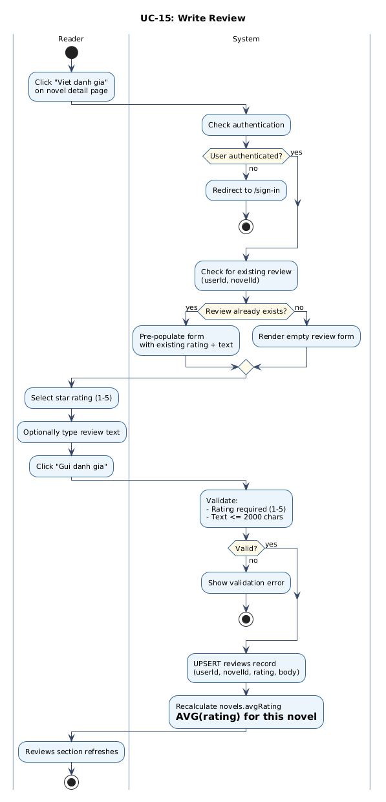{ width=6in }

1. Reader clicks "Viết đánh giá" in the reviews section.
2. System checks whether the user already has a review for this novel.
3. The review form opens (modal or inline). If an existing review exists, the form is pre-populated with the prior rating and text.
4. Reader selects a star rating (1–5 by clicking star icons).
5. Reader optionally types review text in the textarea.
6. Reader clicks "Gửi đánh giá".
7. System validates: rating is required (1–5), text length ≤ 2,000 characters.
8. System inserts or updates the `reviews` record (`userId`, `novelId`, `rating`, `body`, `updatedAt`).
9. System recalculates `novels.avgRating` as the average of all ratings for the novel.
10. The reviews section refreshes to show the updated review.

#### Business Rules

| Activity | BR Code | Description |
|---|---|---|
| (1), (2) | BR-15-1 | **Authentication Required:** On click: `AuthService.isAuthenticated(request)` &nbsp;&nbsp;if authenticated: show review form &nbsp;&nbsp;else: show sign-in prompt — `ReviewRepository.upsert()` never called |
| (9) | BR-15-2 | **One Review per User:** On submit: `ReviewRepository.upsert(userId, novelId, { rating, body })` &nbsp;&nbsp;// SQL: `INSERT ... ON CONFLICT (userId, novelId) DO UPDATE` &nbsp;&nbsp;// DB unique constraint on `reviews(userId, novelId)` enforces one-per-user |
| (5), (7), (8) | BR-15-3 | **Rating Required:** On validate: `validateRating(rating)` — integer 1–5 &nbsp;&nbsp;if null or out-of-range: block submission &nbsp;&nbsp;// Validated client-side and server-side |
| (6), (8) | BR-15-4 | **Text is Optional:** On validate: `validateReviewBody(body)` — nullable; max 2,000 chars &nbsp;&nbsp;if `body.length > 2000`: `MessageService.show('Nội dung tối đa 2000 ký tự')` |
| (10) | BR-15-5 | **avgRating Recalculation:** On upsert: after `ReviewRepository.upsert()` → `NovelRepository.updateAvgRating(novelId)` &nbsp;&nbsp;// SQL: `UPDATE novels SET avgRating = (SELECT AVG(rating) FROM reviews WHERE novelId = ?)` &nbsp;&nbsp;// Same DB transaction |
| (9), (10) | BR-15-6 | **Review Deletion:** On delete: `ReviewRepository.delete(reviewId, userId)` &nbsp;&nbsp;// Only if `review.userId === requestingUserId` &nbsp;&nbsp;After delete: `NovelRepository.updateAvgRating(novelId)` recalculates |

\pagebreak

---

### UC-16: Leave Comment (FR-5.2)

| Field | Detail |
|---|---|
| **Name** | Leave Comment |
| **Description** | A reader posts a text comment on a novel. Comments support one level of nesting (replies to top-level comments). |
| **Actor** | Reader |
| **Trigger** | The reader types in the comment text box on the novel detail page and clicks "Gửi". |
| **Pre-condition** | The user is authenticated. |
| **Post-condition** | A `comments` record is inserted. The comment appears immediately at the top of the comments section. |

#### Activities Flow

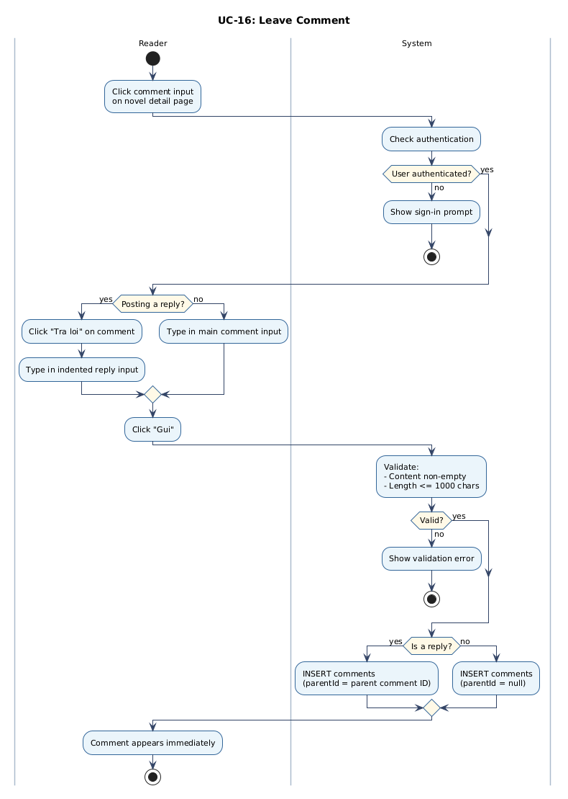{ width=6in }

1. Reader types a comment in the text input at the top of the comments section.
2. Reader clicks "Gửi".
3. System validates the comment is non-empty and within the character limit.
4. System inserts a `comments` record with `userId`, `targetType = novel`, `targetId = novelId`, `content`, `parentId = null`, `createdAt`.
5. The comment appears at the top of the list (newest first).
6. For replies: reader clicks "Trả lời" on an existing comment.
7. An indented reply input appears.
8. Reader types and submits the reply.
9. System inserts a `comments` record with `parentId` referencing the parent comment.
10. The reply appears indented below the parent comment.

#### Business Rules

| Activity | BR Code | Description |
|---|---|---|
| (1), (2) | BR-16-1 | **Authentication Required:** On submit: `AuthService.isAuthenticated(request)` &nbsp;&nbsp;if authenticated: proceed to `CommentRepository.create()` &nbsp;&nbsp;else: show inline sign-in prompt — `CommentRepository.create()` never called |
| (6) | BR-16-2 | **Character Limit:** On validate: `validateCommentContent(content)` — non-empty AND `content.length <= 1000` &nbsp;&nbsp;if empty: `MSG('Nội dung không được để trống')` &nbsp;&nbsp;if too long: `MSG('Tối đa 1000 ký tự')` |
| (3), (7) | BR-16-3 | **Nesting Depth:** On create: `CommentRepository.create({ parentId })` &nbsp;&nbsp;if `parentId` given: API verifies `parent.parentId === null` &nbsp;&nbsp;if reply-to-reply: rejected with HTTP 400 |
| (7) | BR-16-4 | **Edit / Delete Window:** On check: `CommentService.canEdit(comment, user)` &nbsp;&nbsp;// Condition: `userId match && (now - createdAt) < 900000` ms &nbsp;&nbsp;// Admins/curators bypass the 15-min check |
| (7) | BR-16-5 | **Moderation:** On report: `ReportService.flag(commentId)` → sets `comment.isHidden = true` on sufficient reports &nbsp;&nbsp;On fetch: `CommentRepository.findAll({ isHidden: false })` &nbsp;&nbsp;// Excludes hidden comments from public view |
| (7), (8) | BR-16-6 | **Comment Ordering:** Top-level: `CommentRepository.findAll({ sort: 'createdAt', order: 'desc' })` &nbsp;&nbsp;Replies: `CommentRepository.findReplies(parentId, { sort: 'createdAt', order: 'asc' })` |

\pagebreak

---

### UC-17: Purchase Coins (FR-6.1)

| Field | Detail |
|---|---|
| **Name** | Purchase Coins |
| **Description** | A reader purchases a coin package using the MoMo payment gateway. On successful payment, the reader's coin balance is incremented atomically and a ledger entry is written. |
| **Actor** | Reader, MoMo Gateway |
| **Trigger** | The reader clicks "Mua [N] xu" on a coin package card at `/pricing`. |
| **Pre-condition** | The user is authenticated. At least one active coin package exists in the `coin_packages` table. |
| **Post-condition** | `users.coin_balance` is incremented by `totalCoins` (base + bonus). A `payments` record with `status = COMPLETED` exists. A `coin_transactions` record with `type = CREDIT` exists. |

#### Activities Flow

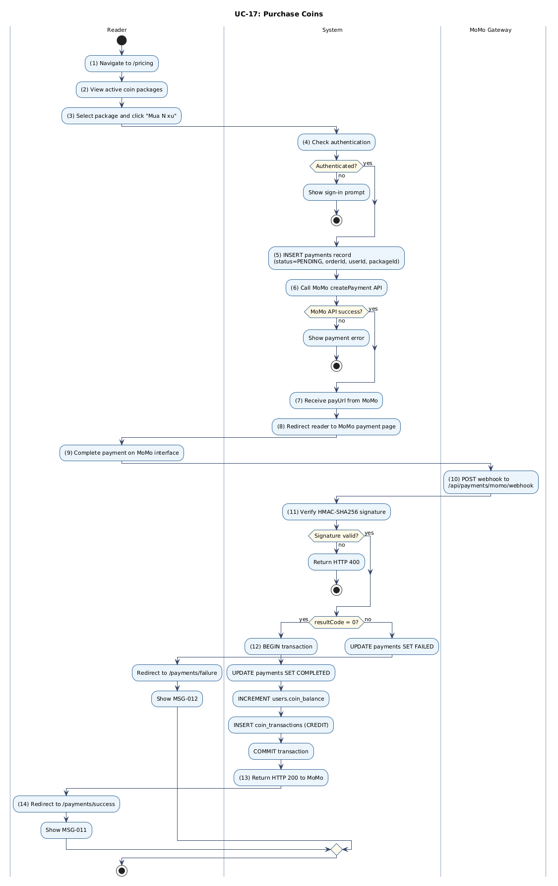{ width=6in }

1. Reader navigates to `/pricing`.
2. System fetches and displays active coin packages.
3. Reader selects a package and clicks the buy button.
4. System creates a `payments` record with `status = PENDING`, unique `orderId`, `userId`, `packageId`, `amountVnd`.
5. System calls the MoMo `createPayment` API with the `orderId`, amount, and redirect URLs.
6. MoMo returns a `payUrl`.
7. System redirects the reader to the MoMo payment page (external).
8. Reader completes the payment on MoMo's interface.
9. MoMo sends a `POST` webhook to `/api/payments/momo/webhook`.
10. System verifies the HMAC-SHA256 signature on the incoming webhook.
11. If the signature is invalid, the system responds HTTP 400 and discards the request.
12. If the signature is valid and `resultCode = 0` (success):
    - System begins a database transaction.
    - Updates `payments.status = COMPLETED`.
    - Increments `users.coin_balance` by `totalCoins`.
    - Inserts a `coin_transactions` row with `type = CREDIT`, `amount = totalCoins`.
    - Commits the transaction.
13. System returns HTTP 200 to MoMo.
14. User is redirected from MoMo to the success page with MSG-011.

#### Business Rules

| Activity | BR Code | Description |
|---|---|---|
| (4) | BR-17-1 | **Authentication Required:** On purchase: `AuthService.isAuthenticated(request)` &nbsp;&nbsp;if authenticated: proceed to `PaymentRepository.create()` &nbsp;&nbsp;else: show sign-in prompt, abort — `MoMoService.createPayment()` never called |
| (11) | BR-17-2 | **HMAC Verification:** On webhook: `MoMoService.verifyHmac(payload, signature, secret)` &nbsp;&nbsp;// `createHmac('sha256').update(data).digest('hex') === signature` &nbsp;&nbsp;if valid: process payment &nbsp;&nbsp;else: HTTP 400, `LogService.warn('momo-invalid-hmac')` — no DB changes |
| (12) | BR-17-3 | **Atomic Update:** On success: `db.transaction(() => {` &nbsp;&nbsp;`PaymentRepository.update(orderId, { status: 'COMPLETED' })` &nbsp;&nbsp;`UserRepository.incrementCoins(totalCoins)` &nbsp;&nbsp;`CoinTransactionRepository.create({ type: 'CREDIT', amount: totalCoins })` `})` &nbsp;&nbsp;// All three writes succeed or all roll back |
| (12) | BR-17-4 | **Idempotency:** On webhook: `PaymentRepository.findByOrderId(orderId)` &nbsp;&nbsp;if `status === 'COMPLETED'`: return HTTP 200, skip transaction &nbsp;&nbsp;// Prevents double-crediting on MoMo webhook retries |
| (5), (6) | BR-17-5 | **Sandbox Environment:** On init: `MoMoService.createPayment({ sandbox: process.env.NODE_ENV !== 'production' })` &nbsp;&nbsp;// Sandbox in dev — no real money charged &nbsp;&nbsp;// Disclaimer displayed in `/pricing` footer |
| (12) | BR-17-6 | **Failed Payment:** On failure: `resultCode !== 0` &nbsp;&nbsp;→ `PaymentRepository.update(orderId, { status: 'FAILED' })` &nbsp;&nbsp;// `UserRepository.incrementCoins()` NOT called &nbsp;&nbsp;Redirect: `/payments/failure`, `MessageService.show(MSG-012)` |

\pagebreak

---

### UC-18: Unlock VIP Chapter (FR-6.2)

| Field | Detail |
|---|---|
| **Name** | Unlock VIP Chapter |
| **Description** | A reader spends one or more coins to permanently unlock a VIP chapter, gaining permanent access regardless of future coin balance changes. |
| **Actor** | Reader |
| **Trigger** | The reader clicks "Mở khoá" on the VIP lock overlay while viewing a locked chapter. |
| **Pre-condition** | The user is authenticated. The chapter is VIP and locked for this user. The user's `coin_balance >= chapter.coinCost`. |
| **Post-condition** | A `chapter_unlocks` record is created. `users.coin_balance` is decremented by `coinCost`. A debit `coin_transactions` record is created. The chapter content becomes accessible. |

#### Activities Flow

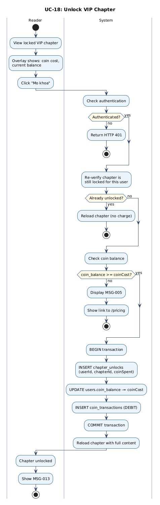{ width=6in }

1. Reader views a VIP chapter and sees the locked overlay.
2. The overlay displays: chapter title, coin cost, the reader's current coin balance.
3. Reader clicks "Mở khoá".
4. System re-verifies (server-side) that the chapter is still locked for this user.
5. System checks that `users.coin_balance >= chapter.coinCost`.
6. If insufficient balance: system displays MSG-005 with a link to `/pricing`. No deduction is made.
7. If balance is sufficient:
   - System begins a database transaction.
   - Inserts a `chapter_unlocks` row (`userId`, `chapterId`, `coinSpent`, `unlockedAt`).
   - Decrements `users.coin_balance` by `coinCost`.
   - Inserts a `coin_transactions` row (`type = DEBIT`, `amount = coinCost`).
   - Commits the transaction.
8. System reloads the chapter with full content now visible.

#### Business Rules

| Activity | BR Code | Description |
|---|---|---|
| (5), (6) | BR-18-1 | **Insufficient Balance:** On check: `UserRepository.getCoins(userId)` &nbsp;&nbsp;if `coinBalance < chapter.coinCost`: &nbsp;&nbsp;&nbsp;&nbsp;`MessageService.show(MSG-005)`, show `/pricing` link &nbsp;&nbsp;&nbsp;&nbsp;// `ChapterUnlockRepository.create()` never called |
| (7) | BR-18-2 | **Atomic Deduction:** On unlock: `db.transaction(() => {` &nbsp;&nbsp;`ChapterUnlockRepository.create(userId, chapterId, coinSpent)` &nbsp;&nbsp;`UserRepository.decrementCoins(coinCost)` &nbsp;&nbsp;`CoinTransactionRepository.create({ type: 'DEBIT', amount: coinCost })` `})` &nbsp;&nbsp;// All three writes succeed or all roll back |
| (7) | BR-18-3 | **Permanent Unlock:** On create: `ChapterUnlockRepository.create()` — no TTL, no expiry &nbsp;&nbsp;// `ChapterUnlockRepository.delete()` does not exist &nbsp;&nbsp;// Access persists regardless of future coin balance |
| (7) | BR-18-4 | **Default Coin Cost:** On create: `chapter.coinCost` defaults to `1` at `ChapterRepository.create()` &nbsp;&nbsp;// API validates `coinCost >= 1` &nbsp;&nbsp;// Curators set value in UC-22 |
| (4) | BR-18-5 | **Guest Redirect:** On access: `AuthService.isAuthenticated(request)` &nbsp;&nbsp;if not authenticated: HTTP 401 &nbsp;&nbsp;→ `RedirectService.redirectToSignIn('/novels/[slug]/chapters/[number]')` |
| (5) | BR-18-6 | **Subscription Bypass:** On check: `SubscriptionRepository.findActive(userId, { now })` &nbsp;&nbsp;if active subscription: `isLocked = false` &nbsp;&nbsp;// Lock overlay never shown; no coins deducted |

\pagebreak

---

### UC-19: Update Profile (FR-7.1)

| Field | Detail |
|---|---|
| **Name** | Update Profile |
| **Description** | An authenticated user updates their display name and bio (self-introduction) from the account settings page. |
| **Actor** | Reader, Curator, Admin |
| **Trigger** | The user navigates to `/settings` and clicks "Lưu thay đổi" after editing their profile fields. |
| **Pre-condition** | The user is authenticated. |
| **Post-condition** | The `users.name` and `users.bio` fields are updated in the database. A success notification is displayed. |

#### Activities Flow

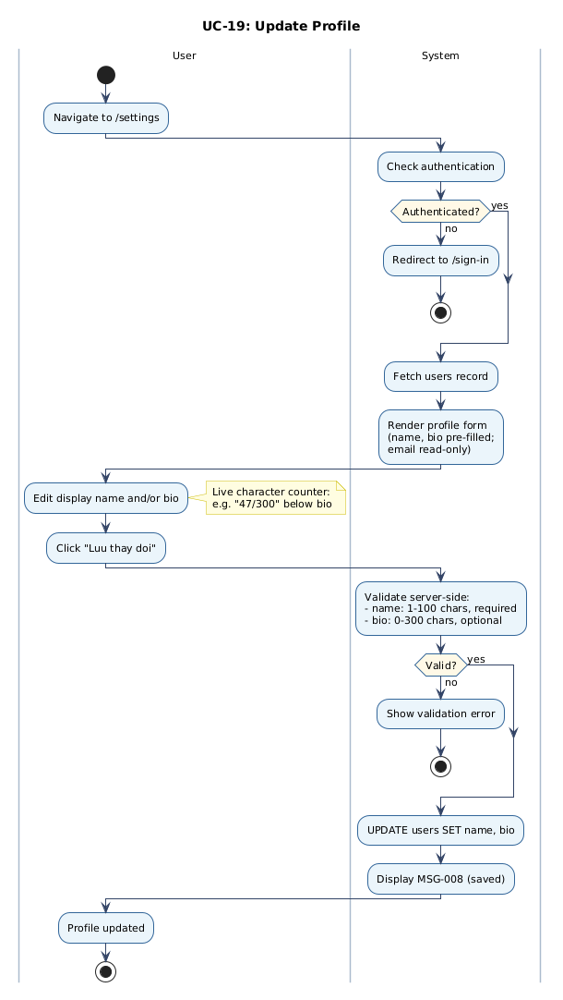{ width=5in }

1. User navigates to `/settings`.
2. System verifies authentication; unauthenticated users are redirected to `/sign-in`.
3. System fetches the current user record and renders the profile form pre-populated with `name` and `bio`.
4. The `email` field is displayed as read-only (disabled input).
5. User edits the display name and/or bio.
6. The bio textarea shows a live character counter (e.g., "47/300") that updates as the user types.
7. User clicks "Lưu thay đổi".
8. System validates the inputs server-side.
9. System updates the `users` record with the new `name` and `bio`.
10. System displays a success toast: MSG-008.

#### Business Rules

| Activity | BR Code | Description |
|---|---|---|
| (7), (8) | BR-19-1 | **Display Name Validation:** On submit: `validateDisplayName(name)` — required, 1–100 chars, non-blank &nbsp;&nbsp;if valid: `UserRepository.update({ name })` &nbsp;&nbsp;else: `MessageService.show(MSG-014)`, abort — `UserRepository.update()` not called |
| (5), (6), (7) | BR-19-2 | **Bio Optional:** On input: `LiveCounterService.update(bio.length, 300)` renders `"{n}/300"` on keystrokes &nbsp;&nbsp;On submit: `validateBio(bio)` — nullable; max 300 chars &nbsp;&nbsp;if `bio.length > 300`: server returns validation error |
| (4), (8) | BR-19-3 | **Email is Immutable:** On render: email field rendered as `<input disabled>` &nbsp;&nbsp;On submit: API payload is `UserRepository.update({ name, bio })` &nbsp;&nbsp;// `email` key explicitly omitted — ignored if present in request body |
| (2) | BR-19-4 | **Protected Route:** On navigate: `MiddlewareService.protect('/settings')` &nbsp;&nbsp;if authenticated: render settings &nbsp;&nbsp;else: redirect to `/sign-in?callbackURL=/settings` &nbsp;&nbsp;// Enforced at Next.js middleware before page renders |

\pagebreak

---

### UC-20: Change Password (FR-7.2)

| Field | Detail |
|---|---|
| **Name** | Change Password |
| **Description** | An authenticated user with an email/password account changes their account password. All other active sessions are invalidated after a successful change. |
| **Actor** | Reader, Curator, Admin |
| **Trigger** | The user fills in the "Đổi mật khẩu" form on `/settings` and submits. |
| **Pre-condition** | The user is authenticated and their account has a password (not a Google-only account). |
| **Post-condition** | The password hash is updated. All sessions other than the current one are invalidated. MSG-006 is displayed. |

#### Activities Flow

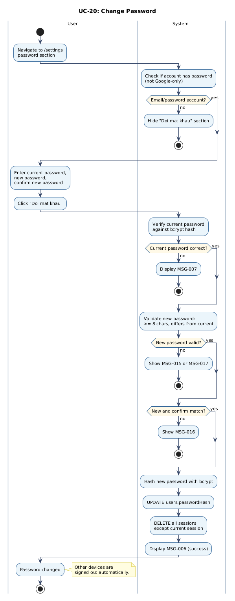{ width=6in }

1. User scrolls to the "Đổi mật khẩu" section on `/settings`.
2. User enters: current password, new password, confirm new password.
3. User clicks "Đổi mật khẩu".
4. System verifies the current password against the stored bcrypt hash.
5. If current password is incorrect: system displays MSG-007 and halts.
6. System validates the new password (minimum length, does not match current).
7. System checks that the new password and confirmation match.
8. System hashes the new password with bcrypt.
9. System updates `users.passwordHash` with the new hash.
10. System deletes all session records for the user except the current session.
11. System displays MSG-006.

#### Business Rules

| Activity | BR Code | Description |
|---|---|---|
| (5) | BR-20-1 | **Current Password Verification:** On submit: `AuthService.verifyPassword(currentPassword, user.passwordHash)` — bcrypt compare &nbsp;&nbsp;if match: proceed to new password checks &nbsp;&nbsp;else: `MessageService.show(MSG-007)`, halt — `UserRepository.update()` never reached |
| (7) | BR-20-2 | **Confirmation Match:** On validate: `validateConfirmPassword(newPassword, confirmPassword)` &nbsp;&nbsp;// Checks: `newPassword === confirmPassword` &nbsp;&nbsp;if mismatch: `MessageService.show(MSG-016)`, halt |
| (6) | BR-20-3 | **Minimum Length:** On validate: `validatePassword(newPassword)` &nbsp;&nbsp;// Checks: `newPassword.length >= 8` &nbsp;&nbsp;if too short: `MessageService.show(MSG-015)`, halt |
| (6) | BR-20-4 | **No Password Reuse:** On check: `AuthService.isDifferentPassword(newPassword, user.passwordHash)` — bcrypt compare must return false &nbsp;&nbsp;if same as current: `MessageService.show(MSG-017)`, halt |
| (1), (2) | BR-20-5 | **Google Account Exclusion:** On render: `UserRepository.hasPassword(userId)` — checks `passwordHash IS NOT NULL` &nbsp;&nbsp;if false: "Đổi mật khẩu" section hidden in Server Component &nbsp;&nbsp;if direct API call: HTTP 403 |
| (10) | BR-20-6 | **Session Invalidation:** On success: `SessionRepository.deleteAllExcept(userId, currentSessionId)` &nbsp;&nbsp;// Other devices forced to re-authenticate on next request |

\pagebreak

---

### UC-21: Curator Manage Novel (FR-8.1)

| Field | Detail |
|---|---|
| **Name** | Curator Manage Novel |
| **Description** | A curator creates a new novel or edits an existing one. This includes setting all metadata fields, uploading a cover image, and associating genres and tags. |
| **Actor** | Curator |
| **Trigger** | The curator navigates to `/curator/novels/new` (create) or `/curator/novels/[id]/edit` (edit). |
| **Pre-condition** | The user is authenticated and has `role = curator` or `role = admin`. |
| **Post-condition** | The `novels` record is inserted or updated. Associated `novel_genres` and `novel_tags` junction table rows are synchronized. |

#### Activities Flow

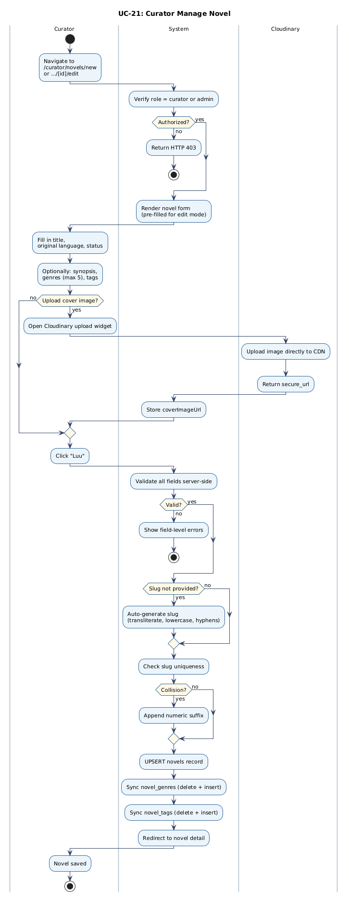{ width=6in }

1. Curator opens the novel form via the CMS.
2. System renders the form. For edit mode: pre-populated with existing novel data.
3. Curator fills in required fields: title, original language, publication status.
4. Curator optionally fills in: synopsis, slug (auto-generated if blank), genres (multi-select, max 5), tags (multi-select or free-text), cover image.
5. For cover image: curator uploads via the Cloudinary upload widget. The widget uploads directly to Cloudinary and returns a `secure_url`.
6. System stores the Cloudinary `secure_url` in `novels.coverImageUrl`.
7. Curator clicks "Lưu".
8. System validates all fields server-side.
9. System generates a slug from the title if not provided (lowercase, hyphens, Vietnamese transliteration).
10. System checks slug uniqueness; if a collision occurs, appends a numeric suffix.
11. System upserts the `novels` record.
12. System synchronizes `novel_genres` and `novel_tags` junction rows (delete all existing, insert selected).
13. System redirects to the novel detail page or the chapter management list.

#### Business Rules

| Activity | BR Code | Description |
|---|---|---|
| (9) | BR-21-1 | **Required Fields Validation:** On submit: `validateNovelForm({ title, language, status })` &nbsp;&nbsp;// Checks: title 1–500 chars; language in `['ZH','KO','JA','EN','VI']`; status in `['ONGOING','COMPLETED','HIATUS','DROPPED']` &nbsp;&nbsp;if invalid: field-level errors displayed — `NovelRepository.upsert()` not called |
| (10), (11) | BR-21-2 | **Slug Format and Uniqueness:** On validate: `SlugValidator.validate(slug)` — must match `/^[a-z0-9]+(?:-[a-z0-9]+)*$/` &nbsp;&nbsp;On check: `NovelRepository.findBySlug(slug)` &nbsp;&nbsp;if collision: `SlugService.appendSuffix(slug, n)` tries `slug-2`, `slug-3`… &nbsp;&nbsp;// DB unique index as final guard |
| (10) | BR-21-3 | **Auto-Slug:** On blank slug: `SlugService.generate(title)` &nbsp;&nbsp;// `vietnameseToLatin(title).toLowerCase().replace(/[^a-z0-9]+/g, '-')` &nbsp;&nbsp;// Called before `SlugValidator.validate()` |
| (5), (6), (7) | BR-21-4 | **Cover Image:** On upload: `CloudinaryService.upload(file, { allowedFormats: ['jpg','png','webp'], maxFileSize: 5242880 })` &nbsp;&nbsp;// Only `secure_url` stored &nbsp;&nbsp;→ `NovelRepository.upsert({ coverImageUrl: secure_url })` |
| (5) | BR-21-5 | **Genre Limit:** On validate: `validateGenres(genres)` — `genres.length <= 5` &nbsp;&nbsp;if > 5: field error "Tối đa 5 thể loại" &nbsp;&nbsp;// `NovelGenreRepository.sync()` only called when valid |
| (1), (2) | BR-21-6 | **CMS Access Control:** On navigate: `MiddlewareService.verifyRole('/curator/**', ['curator','admin'])` &nbsp;&nbsp;if neither role: HTTP 403, `MessageService.show(MSG-020)` |

\pagebreak

---

### UC-22: Curator Manage Chapter (FR-8.2)

| Field | Detail |
|---|---|
| **Name** | Curator Manage Chapter |
| **Description** | A curator creates, edits, and controls the publication state of chapters belonging to a novel. Chapters can be saved as drafts or published immediately or on a schedule. |
| **Actor** | Curator |
| **Trigger** | The curator opens the chapter editor at `/curator/novels/[id]/chapters/new` or `/curator/novels/[id]/chapters/[chId]/edit`. |
| **Pre-condition** | The user has the `curator` or `admin` role. The parent novel exists. |
| **Post-condition** | The `chapters` record is created or updated. If published, `publishedAt` is set and `novels.totalChapters` is incremented. |

#### Activities Flow

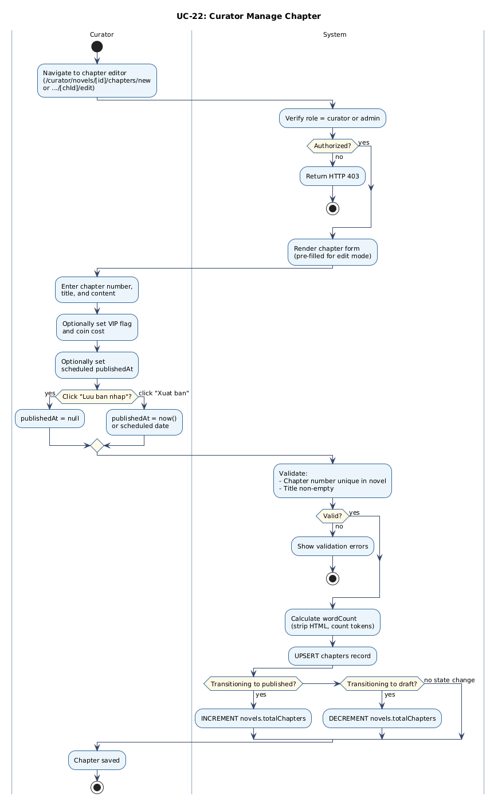{ width=6in }

1. Curator opens the chapter form via the CMS.
2. System renders the chapter editor. For edit mode: pre-populated with existing chapter data.
3. Curator fills in: chapter number, chapter title, content (rich text editor).
4. Curator optionally toggles the VIP flag and sets the coin cost.
5. Curator optionally sets a scheduled `publishedAt` date/time.
6. Curator clicks:
   - **"Lưu bản nháp"**: saves with `publishedAt = null`. Chapter is not visible to readers.
   - **"Xuất bản"**: saves with `publishedAt = now()` (or the scheduled date).
7. System validates: chapter number is a positive integer, unique within the novel; title is non-empty.
8. System calculates `wordCount` by stripping HTML tags from the content and counting space-delimited tokens.
9. System inserts or updates the `chapters` record.
10. If publishing (setting `publishedAt`): system atomically increments `novels.totalChapters`.
11. If reverting from published to draft: system atomically decrements `novels.totalChapters`.

#### Business Rules

| Activity | BR Code | Description |
|---|---|---|
| (8) | BR-22-1 | **Chapter Number Uniqueness:** On validate: `ChapterRepository.findByNovelAndNumber(novelId, chapterNumber)` &nbsp;&nbsp;if found: validation error displayed &nbsp;&nbsp;// `ChapterRepository.upsert()` not called on conflict |
| (9) | BR-22-2 | **Word Count Calculation:** On save: `WordCountService.calculate(html)` → `stripHtml(html).split(/\s+/).filter(Boolean).length` &nbsp;&nbsp;// Server-side only; stored in `chapters.wordCount`; not editable by curator |
| (7), (10) | BR-22-3 | **Draft Visibility:** On fetch: `ChapterRepository.findPublished()` excludes `publishedAt IS NULL` &nbsp;&nbsp;// Drafts visible only in `ChapterRepository.findAllByCurator(novelId)` (CMS only) |
| (6), (10) | BR-22-4 | **Scheduled Chapters:** On fetch: `ChapterRepository.findPublished()` filters `WHERE publishedAt <= now()` &nbsp;&nbsp;// Future `publishedAt` → treated as draft &nbsp;&nbsp;// No cron needed — query handles it on each request |
| (5) | BR-22-5 | **VIP Flag:** On API call: `AuthService.verifyRole(userId, ['curator','admin'])` &nbsp;&nbsp;// Enforced in API handler before setting `isVip` &nbsp;&nbsp;if reader attempts direct call: HTTP 403 |
| (11) | BR-22-6 | **Chapter Count Sync:** On publish: null → timestamp &nbsp;&nbsp;→ `NovelRepository.incrementTotalChapters(novelId)` &nbsp;&nbsp;On unpublish: timestamp → null &nbsp;&nbsp;→ `NovelRepository.decrementTotalChapters(novelId)` &nbsp;&nbsp;// Both atomic with `ChapterRepository.upsert()` |
| (10) | BR-22-7 | **Content Safety:** On store: `HtmlSanitizer.sanitize(content, allowlist)` &nbsp;&nbsp;// Allowlist: `p, br, strong, em, h1–h3, ul, ol, li, blockquote, hr` &nbsp;&nbsp;On render: `DOMPurify.sanitize(content)` before `dangerouslySetInnerHTML` |

\pagebreak

---

### UC-23: Admin Manage System (FR-9.1)

| Field | Detail |
|---|---|
| **Name** | Admin Manage System |
| **Description** | An admin performs system administration tasks: managing user accounts and roles, configuring coin packages, reviewing audit logs, and moderating reported content. All admin actions are logged. |
| **Actor** | Admin |
| **Trigger** | The admin navigates to `/admin` or any sub-page of the admin dashboard. |
| **Pre-condition** | The user is authenticated with `role = admin`. |
| **Post-condition** | The requested administrative action is executed. An `audit_logs` entry is created for every state-changing operation. |

#### Activities Flow

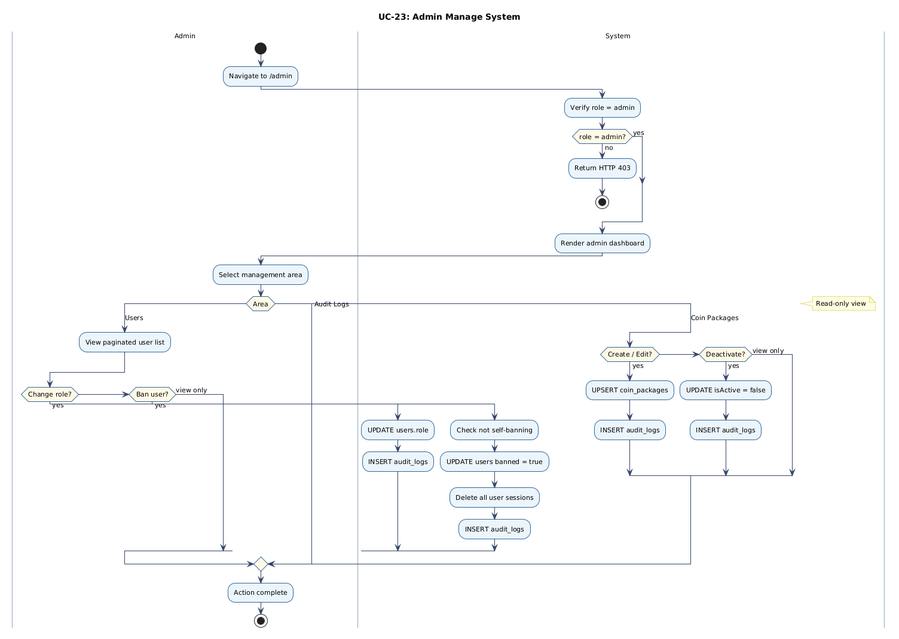{ width=6in }

1. Admin navigates to the admin dashboard (`/admin`).
2. System verifies `role = admin`; non-admin users receive HTTP 403.
3. Admin selects a management area from the sidebar:
   - **Users** (`/admin/users`): paginated list of all users with role, status, and join date.
   - **Coin Packages** (`/admin/coin-packages`): list of all coin packages (active and inactive).
   - **Audit Logs** (`/admin/audit-logs`): chronological event feed of all admin actions.
   - **Reports** (Phase 3): moderation queue for reported comments and reviews.
4. **User management actions:**
   - Admin views user profile details and current role.
   - Admin changes a user's role (`reader ↔ curator`).
   - Admin bans or unbans a user account.
   - Each change is written to `audit_logs`.
5. **Coin package actions:**
   - Admin creates a new coin package (coins, bonusCoins, priceVnd, isActive).
   - Admin edits an existing package's values.
   - Admin deactivates a package (hidden from `/pricing` but existing purchases are unaffected).
   - Each change is written to `audit_logs`.
6. **Audit log viewing:**
   - Admin views the event feed, filtered by date range or action type.
   - No mutations are possible from the audit log view.

#### Business Rules

| Activity | BR Code | Description |
|---|---|---|
| (2), (5) | BR-23-1 | **Role Escalation:** On role change: `AuthService.verifyRole(requestingUserId, ['admin'])` &nbsp;&nbsp;before: `UserRepository.update(targetUserId, { role })` &nbsp;&nbsp;if not admin: HTTP 403 — button not rendered in curator UI |
| (5) | BR-23-2 | **Self-Ban Prevention:** On ban: `AdminService.canBan(adminId, targetUserId)` &nbsp;&nbsp;if `adminId === targetUserId`: throw `SELF_BAN_FORBIDDEN`, HTTP 400 &nbsp;&nbsp;// Ban button hidden via `isOwnRecord` flag in `UserRowComponent` |
| (6) | BR-23-3 | **Audit Log Immutability:** On action: `AuditLogRepository.create({ adminId, action, targetType, targetId, metadata, createdAt: now() })` &nbsp;&nbsp;// Insert-only — no `.update()` or `.delete()` methods exist &nbsp;&nbsp;// Entries can never be modified |
| (5), (6) | BR-23-4 | **Audit Log Coverage:** On any state change: `AuditLogRepository.create({ adminId, action, targetType, targetId, metadata: JSON.stringify(details) })` &nbsp;&nbsp;// Covers: role change, ban/unban, package create/edit/deactivate, content removal |
| (5) | BR-23-5 | **Package Deactivation:** On deactivate: `CoinPackageRepository.update(id, { isActive: false })` &nbsp;&nbsp;`findActive()` filters `WHERE isActive = true` &nbsp;&nbsp;// Package hidden from `/pricing`; historical records unchanged |
| (2) | BR-23-6 | **Admin-Only Access:** On navigate: `MiddlewareService.verifyRole('/admin/**', ['admin'])` &nbsp;&nbsp;if not admin: HTTP 403, `MessageService.show(MSG-020)` &nbsp;&nbsp;// Enforced at Next.js middleware before any admin page or API route |

\pagebreak

# 3. Non-Functional Requirements

## 3.1 User Access and Security

The following matrix defines access control across all system functions. Roles are additive — Reader permissions are a strict subset of Curator, and Curator is a strict subset of Admin unless explicitly noted.

`X` = access granted &nbsp;&nbsp; `X(*)` = access to own data only &nbsp;&nbsp; `—` = no access

| Function / Data | Guest | Reader | Curator | Admin |
|---|---|---|---|---|
| Browse novel list | X | X | X | X |
| Search novels | X | X | X | X |
| View novel detail | X | X | X | X |
| Read free chapter | X | X | X | X |
| Read VIP chapter | — | X(*) | X(*) | X |
| Write review | — | X(*) | X(*) | X |
| Edit / delete own review | — | X(*) | X(*) | X(*) |
| Delete any review | — | — | — | X |
| Leave comment | — | X(*) | X(*) | X |
| Edit / delete own comment | — | X(*) | X(*) | X(*) |
| Delete any comment | — | — | X | X |
| Follow novel | — | X(*) | X(*) | X |
| View own library | — | X(*) | X(*) | X(*) |
| Purchase coins | — | X(*) | — | — |
| View own coin balance | — | X(*) | X(*) | X(*) |
| Unlock VIP chapter (coins) | — | X(*) | X(*) | X |
| Update own profile | — | X(*) | X(*) | X(*) |
| Change own password | — | X(*) | X(*) | X(*) |
| Create / edit novel | — | — | X | X |
| Create / edit chapter | — | — | X | X |
| Publish / unpublish chapter | — | — | X | X |
| View CMS | — | — | X | X |
| Manage all users | — | — | — | X |
| Change user roles | — | — | — | X |
| Ban / unban users | — | — | — | X |
| Manage coin packages | — | — | — | X |
| View audit logs | — | — | — | X |
| Moderate reported content | — | — | — | X |
| View any user's data | — | — | — | X |

## 3.2 Performance Requirements

| Requirement | Target | Notes |
|---|---|---|
| Home page LCP | ≤ 2.5 s | Measured on a 4G mobile connection |
| Novel list page server response | ≤ 500 ms | P95 under normal load |
| Search result latency (Meilisearch) | ≤ 200 ms | P95 for queries returning ≤ 30 results |
| Chapter page server response | ≤ 1 s | Including VIP access check |
| Payment webhook processing | ≤ 3 s | From receipt to DB commit |
| Concurrent reader sessions | ≥ 500 | Limited by Neon free-tier connection pool |
| Image load time (novel cover) | ≤ 1 s | Via Cloudinary CDN with WebP auto-format |

## 3.3 Availability and Reliability

| Requirement | Target |
|---|---|
| Platform uptime | ≥ 99.5% monthly (excluding planned maintenance) |
| Database failover (Neon) | Automatic; handled by Neon serverless infrastructure |
| Payment idempotency | MoMo webhooks are retried up to 3 times; the system handles duplicates without double-crediting |
| Graceful degradation | Search falls back to PostgreSQL ILIKE if Meilisearch is unavailable; pages do not hard-error |
| Session expiry handling | Expired sessions cause graceful redirect to sign-in; no data corruption |

## 3.4 Security Requirements

| Requirement | Implementation Detail |
|---|---|
| Password hashing | bcrypt with work factor ≥ 12 |
| Session management | HTTP-only, Secure, SameSite=Lax cookie; session stored in DB |
| OAuth security | State parameter validated on callback; PKCE used where supported |
| Input sanitization | All user-submitted HTML content sanitized with an allowlist before storage |
| XSS prevention | React's default JSX escaping; `dangerouslySetInnerHTML` prohibited for user-controlled content |
| SQL injection prevention | Drizzle ORM parameterized queries; no raw string interpolation in queries |
| Payment webhook security | HMAC-SHA256 signature verification required; invalid-signature requests rejected with HTTP 400 |
| Rate limiting | Sign-in: max 10 failures per IP per 15 minutes; coin purchase: max 5 requests per user per minute |
| Role enforcement | User role is read from the database session on every request; never from a cookie or client header |
| Sensitive route protection | `/library`, `/settings`, `/curator/**`, `/admin/**` protected at the Next.js middleware layer |
| Secrets management | All secrets stored in environment variables (`.env.local`); never committed to source control |

\pagebreak

# 4. System Requirements

## 4.1 Custom Pages

| # | Page Name | Route | Description |
|---|---|---|---|
| 1 | Home | `/` | Featured, trending, and newly updated novel sections |
| 2 | Novel List / Browse | `/novels` | Full searchable, filterable novel catalogue |
| 3 | Novel Detail | `/novels/[slug]` | Novel metadata, chapter list, reviews, tags, recommendations |
| 4 | Chapter Reader | `/novels/[slug]/chapters/[number]` | Distraction-free chapter reading with reader settings |
| 5 | Sign In | `/sign-in` | Email/password sign-in and Google OAuth entry point |
| 6 | Sign Up | `/sign-up` | New account registration form |
| 7 | Pricing / Coin Purchase | `/pricing` | Coin package catalogue and purchase flow |
| 8 | Library | `/library` | Authenticated user's followed novels with progress tracking |
| 9 | Account Settings | `/settings` | Profile editing and password change |
| 10 | Curator Dashboard | `/curator` | CMS landing page for curators |
| 11 | Curator Novel List | `/curator/novels` | List of all novels in the CMS with edit/delete actions |
| 12 | Curator Novel Create | `/curator/novels/new` | Create a new novel record |
| 13 | Curator Novel Edit | `/curator/novels/[id]/edit` | Edit an existing novel's metadata |
| 14 | Curator Chapter List | `/curator/novels/[id]/chapters` | Chapter management list for a specific novel |
| 15 | Curator Chapter Create | `/curator/novels/[id]/chapters/new` | Create and publish a new chapter |
| 16 | Curator Chapter Edit | `/curator/novels/[id]/chapters/[chId]/edit` | Edit an existing chapter |
| 17 | Admin Dashboard | `/admin` | System administration overview with key metrics |
| 18 | Admin User Management | `/admin/users` | User list with role assignment and ban controls |
| 19 | Admin Coin Packages | `/admin/coin-packages` | Coin package CRUD interface |
| 20 | Admin Audit Logs | `/admin/audit-logs` | Chronological feed of all administrative events |
| 21 | Payment Success | `/payments/success` | Post-payment confirmation with coin balance update |
| 22 | Payment Failure | `/payments/failure` | Post-payment failure notice with retry options |
| 23 | 404 Not Found | — | Custom 404 error page |
| 24 | 500 Server Error | — | Custom 500 error page |

## 4.2 Technical Environment

| Attribute | Value |
|---|---|
| Language | TypeScript 5.x |
| Runtime | Node.js 20 LTS |
| Framework | Next.js 16 (App Router, Server Components, API Routes) |
| Database | PostgreSQL 16 via Neon (serverless) |
| ORM | Drizzle ORM |
| Authentication | Better Auth (email/password + Google OAuth) |
| Full-text Search | Meilisearch Cloud |
| Cache | Upstash Redis (serverless) |
| Payment Gateway | MoMo (Sandbox → Production) |
| Image Management | Cloudinary (upload, transformation, CDN delivery) |
| CDN / Edge | Cloudflare |
| UI Library | shadcn/ui (Nova preset), Radix UI, Tailwind CSS v4 |
| Hosting | Vercel (Hobby tier in development; Pro tier on production launch) |
| Package Manager | pnpm |

## 4.3 Development Phases

| Phase | Scope | Status |
|---|---|---|
| Phase 0 | Project scaffold, database schema, authentication setup | Complete |
| Phase 1 | Content module (novels, chapters), curator CMS, basic reading UI | Complete |
| Phase 2 | Monetization: coins, MoMo payment, VIP chapter unlock | In Progress |
| Phase 3 | Community: comments, reviews; search: Meilisearch; notifications | Planned |
| Phase 4 | Admin panel, analytics dashboard, recommendation engine | Planned |

\pagebreak

# 5. Appendixes

## 5.1 Glossary

| Term | Description |
|---|---|
| Admin | A system administrator with full platform access. Responsible for user management, coin package configuration, and content moderation. |
| Audit Log | An immutable chronological record of all administrative actions. Stored in the `audit_logs` table. |
| BR | Business Rule. A numbered constraint within a use case (e.g., BR-01-1). |
| Coin | The platform's virtual currency. 1 coin = 1 VIP chapter unlock. 100 coins ≈ 10,000 VND. |
| CMS | Content Management System. The curator-facing interface at `/curator/**`. |
| Curator | An authenticated user with content management privileges. Can create and publish novels and chapters. |
| Draft | A chapter with `publishedAt IS NULL`. Not visible to readers. |
| ERD | Entity Relationship Diagram. Documents all database tables and their relationships. See `docs/ERD.md`. |
| FR | Functional Requirement code (e.g., FR-2.1). |
| Guest | An unauthenticated visitor. |
| HMAC | Hash-based Message Authentication Code. Used to verify MoMo webhook signatures. |
| LCP | Largest Contentful Paint. A Core Web Vital measuring perceived load speed. Target: ≤ 2.5 s. |
| Library | A reader's personal collection of followed novels with reading progress. Located at `/library`. |
| MSG | System Message Code (e.g., MSG-001). |
| NFR | Non-Functional Requirement. A quality attribute such as performance or security. |
| Novel | A web novel available on the platform. Has metadata, chapters, genres, and tags. |
| OAuth | Open Authorization. The protocol used for Google social sign-in. |
| Reader | An authenticated user with the default role. |
| Reading Progress | A per-user, per-novel record of the last chapter number read. Stored in `reading_progress`. |
| SAD | Software Architecture Document. See `docs/SAD.md`. |
| Scheduled Chapter | A chapter with a future `publishedAt`. Automatically becomes visible after the timestamp. |
| Slug | A URL-safe identifier derived from a title (e.g., `tu-te-than-nong`). Used in novel URLs. |
| SRS | Software Requirements Specification. This document. |
| UC | Use Case code (e.g., UC-01). |
| VIP Chapter | A chapter requiring a coin unlock or active subscription to read. Displayed with a lock icon. |
| Webhook | An HTTP POST callback sent by MoMo to the platform after a payment event. |

## 5.2 Messages

| Message Code | Message Content | Trigger | Button(s) |
|---|---|---|---|
| MSG-001 | Email này đã được đăng ký. Vui lòng sử dụng email khác hoặc đăng nhập. | UC-01: Duplicate email on registration | — |
| MSG-002 | Email hoặc mật khẩu không đúng. Vui lòng thử lại. | UC-02: Sign-in failure | — |
| MSG-003 | Đăng nhập với Google thất bại. Vui lòng thử lại. | UC-03: OAuth flow error or cancellation | Thử lại |
| MSG-004 | Mật khẩu đã được đặt lại thành công. Vui lòng đăng nhập. | UC-05: Successful password reset | Đăng nhập |
| MSG-005 | Số xu không đủ để mở khoá chương này. Vui lòng nạp thêm xu. | UC-18: Insufficient coin balance | Nạp xu |
| MSG-006 | Mật khẩu đã được thay đổi thành công. | UC-20: Successful password change | — |
| MSG-007 | Mật khẩu hiện tại không đúng. Vui lòng thử lại. | UC-20: Current password mismatch | — |
| MSG-008 | Đã lưu thay đổi thành công. | UC-19: Profile update success | — |
| MSG-009 | Đã theo dõi truyện. | UC-12: Follow action | — |
| MSG-010 | Đã bỏ theo dõi truyện. | UC-12: Unfollow action | — |
| MSG-011 | Thanh toán thành công. [N] xu đã được cộng vào tài khoản của bạn. | UC-17: Payment confirmed | Đọc tiếp |
| MSG-012 | Thanh toán thất bại. Vui lòng thử lại hoặc liên hệ hỗ trợ. | UC-17: Payment failure | Thử lại |
| MSG-013 | Chương VIP đã được mở khoá thành công. | UC-18: Chapter unlock success | — |
| MSG-014 | Tên hiển thị phải có từ 1 đến 100 ký tự. | UC-19: Display name validation failure | — |
| MSG-015 | Mật khẩu phải có ít nhất 8 ký tự. | UC-01, UC-05, UC-20: Password too short | — |
| MSG-016 | Mật khẩu xác nhận không khớp. Vui lòng thử lại. | UC-20: Confirmation mismatch | — |
| MSG-017 | Mật khẩu mới phải khác mật khẩu hiện tại. | UC-20: Password reuse | — |
| MSG-018 | Đã xảy ra lỗi. Vui lòng thử lại sau. | Generic server error | Thử lại |
| MSG-019 | Phiên đăng nhập đã hết hạn. Vui lòng đăng nhập lại. | Session expiry | Đăng nhập |
| MSG-020 | Bạn không có quyền truy cập trang này. | HTTP 403 — insufficient role | Về trang chủ |
| MSG-021 | Truyện không tồn tại hoặc đã bị xoá. | HTTP 404 on novel slug | Về trang chủ |
| MSG-022 | Chương không tồn tại hoặc chưa được xuất bản. | HTTP 404 on chapter | Danh sách chương |
| MSG-023 | Email không hợp lệ. Vui lòng kiểm tra lại. | UC-01, UC-02: Email format validation | — |
| MSG-024 | Đã gửi email đặt lại mật khẩu. Vui lòng kiểm tra hộp thư. | UC-05: Reset email sent (neutral) | — |
| MSG-025 | Liên kết đặt lại mật khẩu đã hết hạn hoặc không hợp lệ. | UC-05: Expired or used reset token | Gửi lại |
